# Talks

A collection of my public talks and presentations.

<!-- TALKS_START -->
_Auto-generated — do not edit this section manually._

| Preview | Talk |
|:-------:|:-----|
|  | **[Career Talk 2024](https://cosimameyer.github.io/talks/slides/career-talk-2024/)** |
| 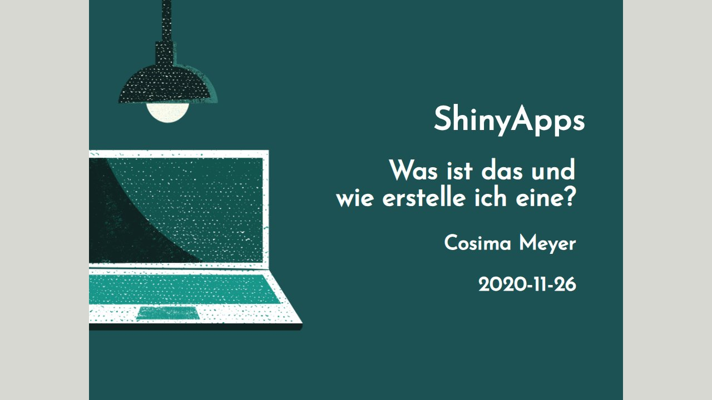 | **[Correlaid Workshop](https://cosimameyer.github.io/talks/slides/correlaid-workshop/)** |
| 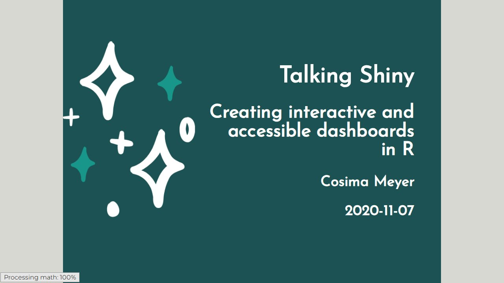 | **[Correlcon](https://cosimameyer.github.io/talks/slides/correlcon/)** |
| 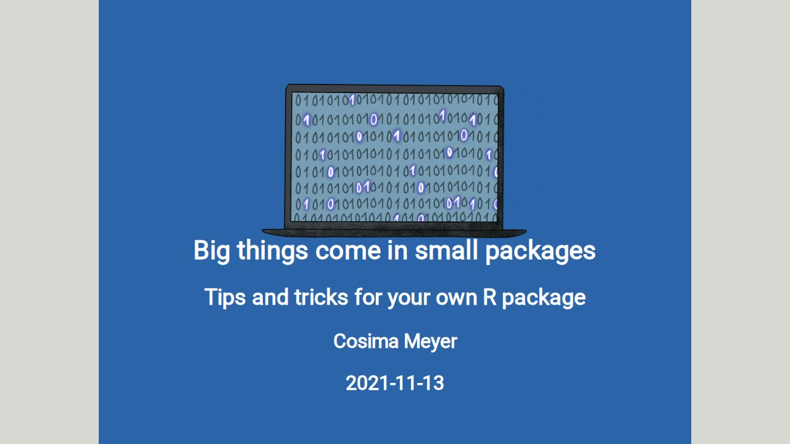 | **[Correlcon2021](https://cosimameyer.github.io/talks/slides/correlcon2021/)** |
| 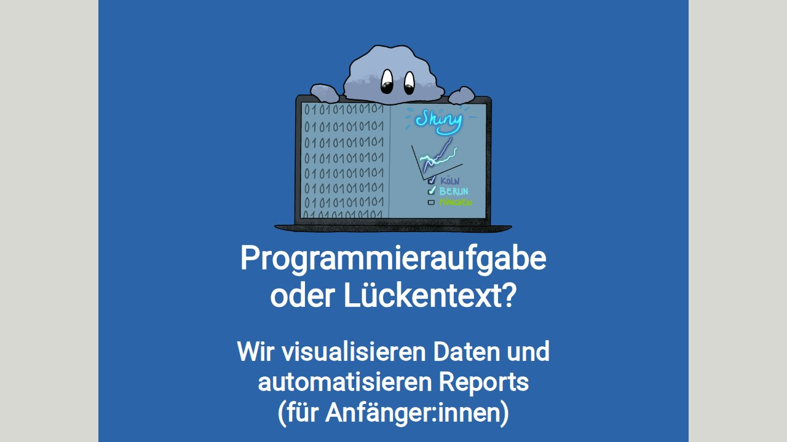 | **[Dss2021](https://cosimameyer.github.io/talks/slides/dss2021/)** |
| 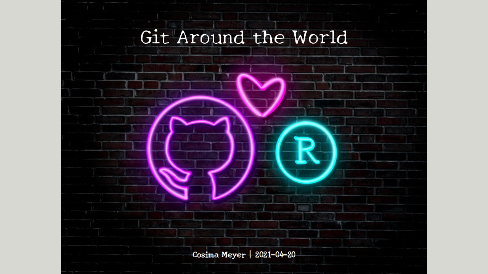 | **[Git Wit](https://cosimameyer.github.io/talks/slides/git-wit/)** |
| 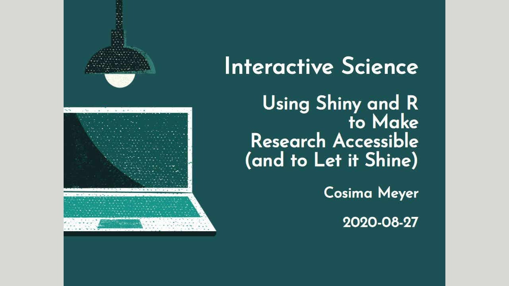 | **[Interactive Science](https://cosimameyer.github.io/talks/slides/interactive-science/)** |
| 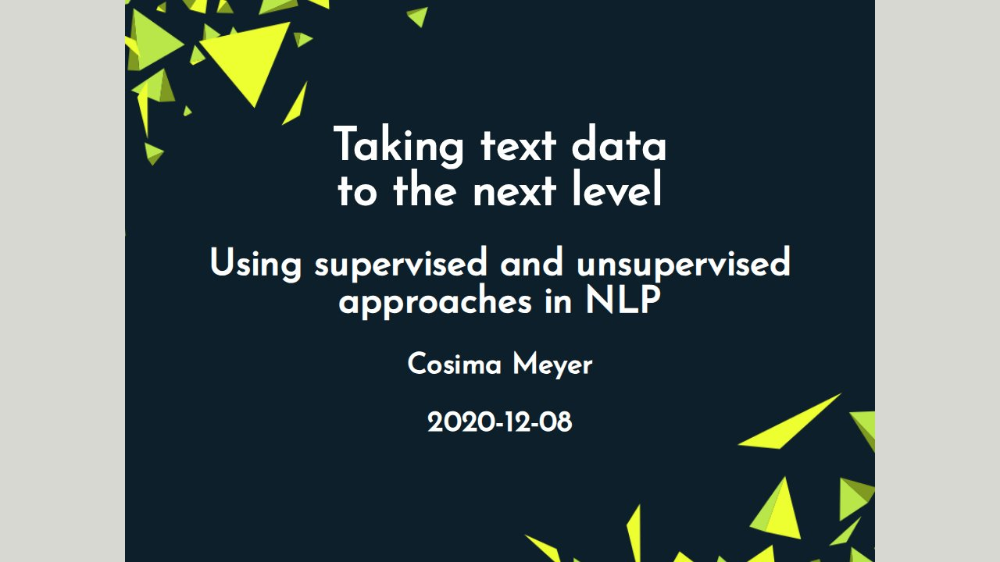 | **[NLP Rladies](https://cosimameyer.github.io/talks/slides/nlp-rladies/)** |
| 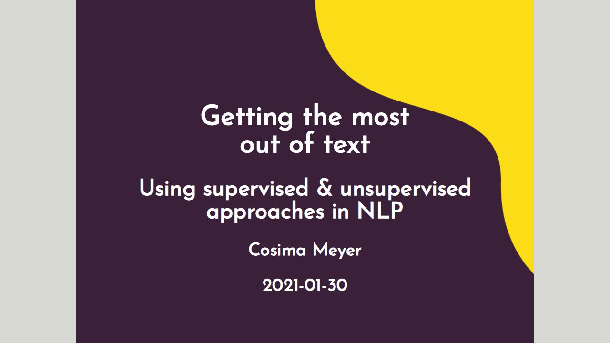 | **[NLP Rladies Tunis](https://cosimameyer.github.io/talks/slides/nlp-rladies-tunis/)** |
| 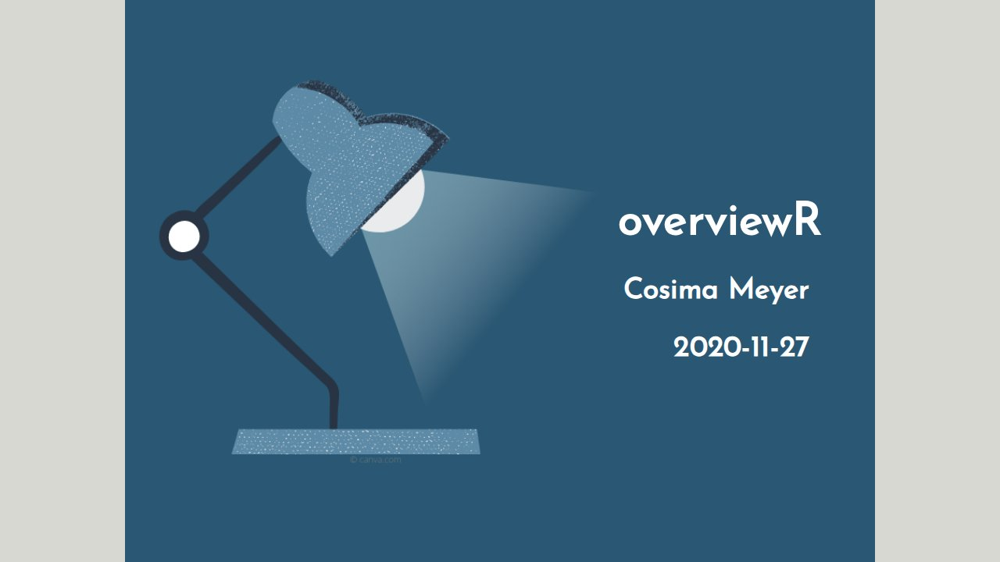 | **[Overviewr](https://cosimameyer.github.io/talks/slides/overviewR/)** |
| 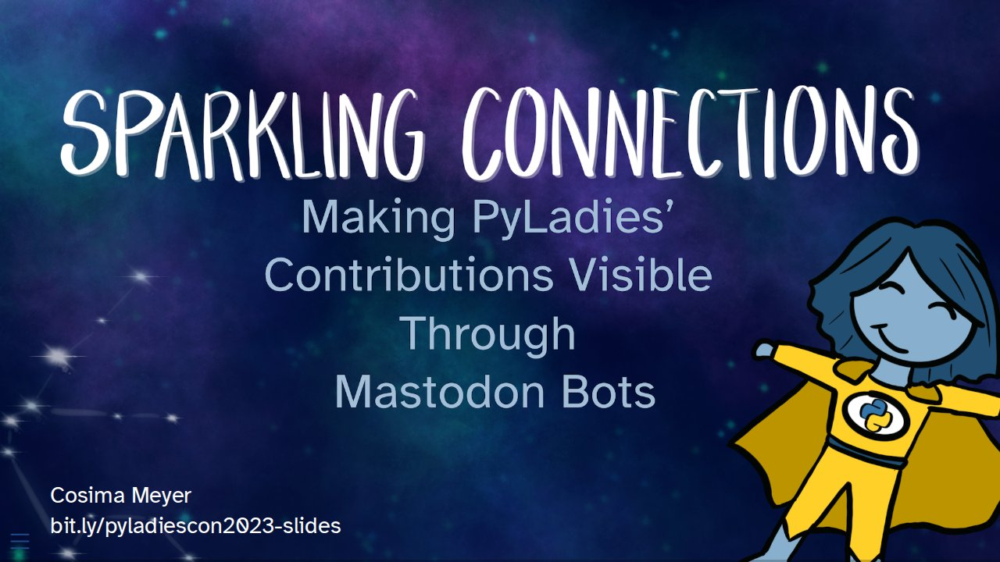 | **[Pyladiescon 2023](https://cosimameyer.github.io/talks/slides/pyladiescon-2023/)** |
| 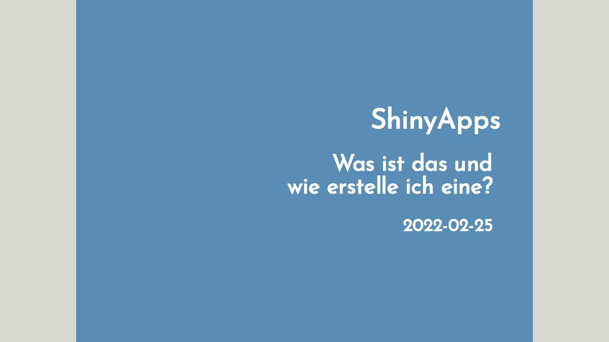 | **[Ram Shiny](https://cosimameyer.github.io/talks/slides/ram-shiny/)** |
| 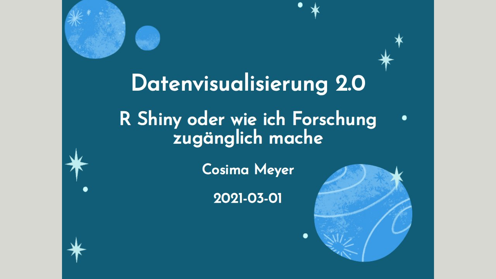 | **[Research Plus](https://cosimameyer.github.io/talks/slides/research-plus/)** |
|  | **[WIDS 2022 Talk](https://cosimameyer.github.io/talks/slides/wids-2022-talk/)** |
| 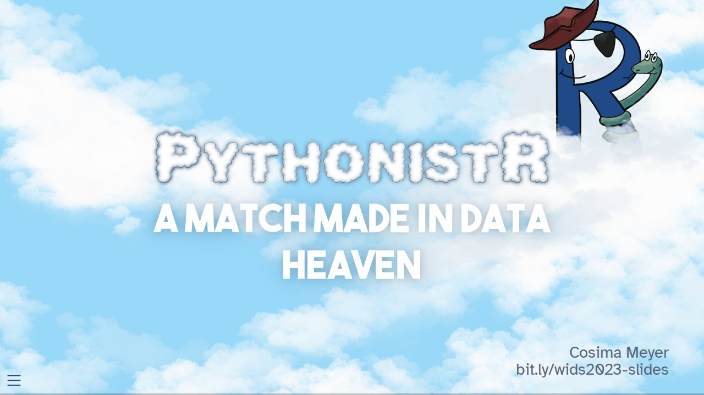 | **[WIDS 2023 Workshop](https://cosimameyer.github.io/talks/slides/wids-2023-workshop/)** |

<!-- TALKS_END -->
