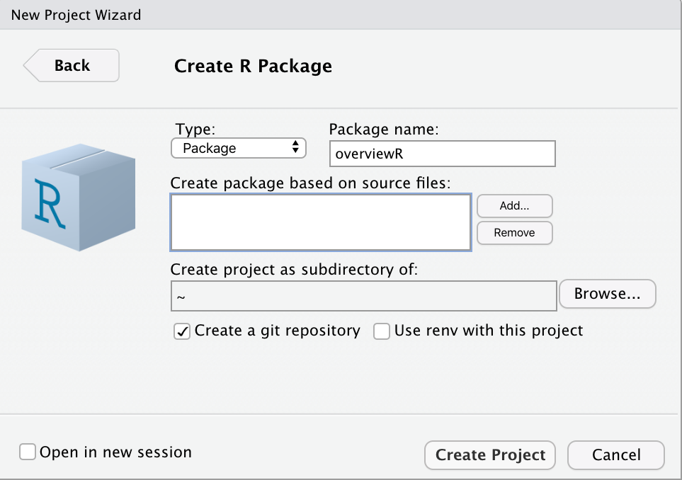
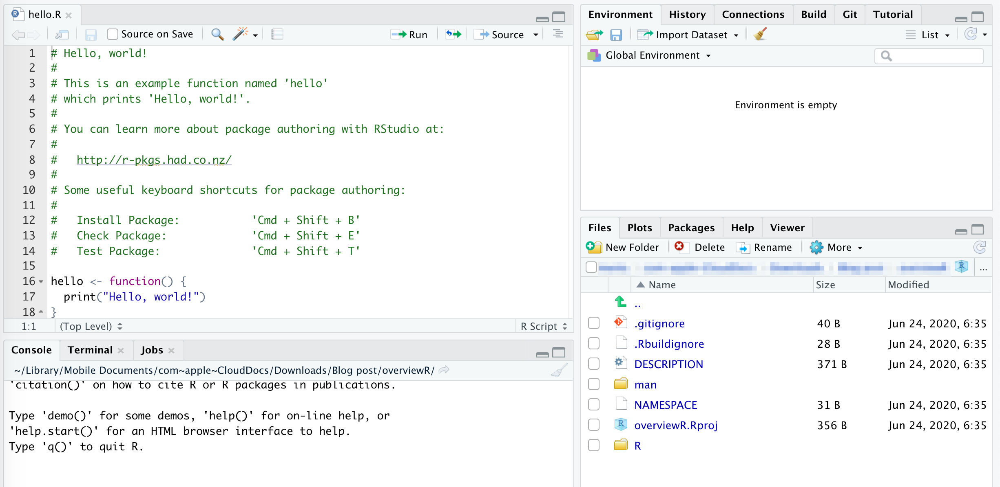
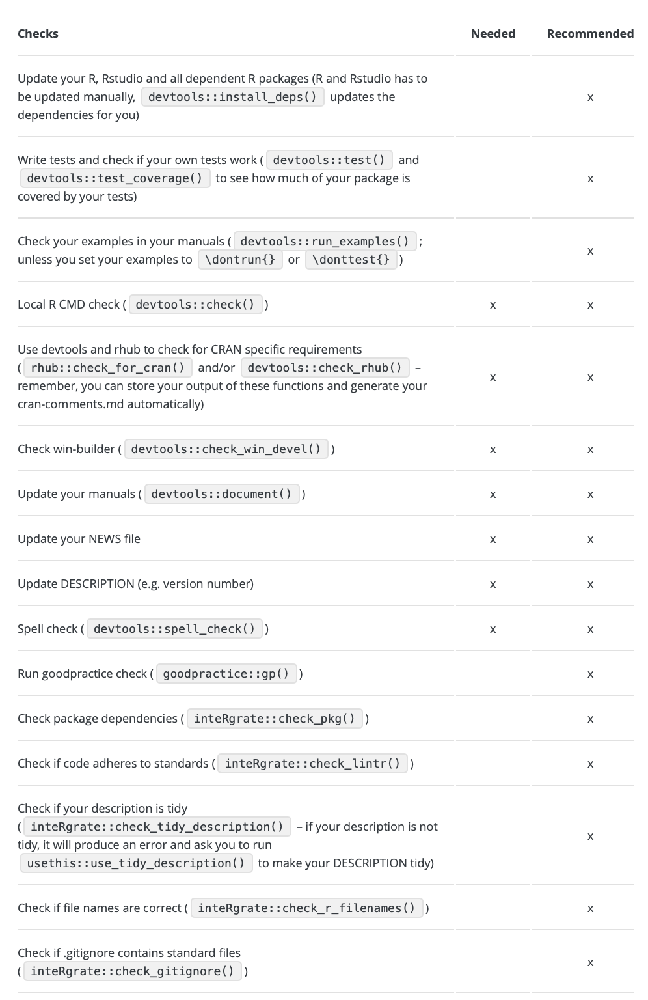

```{r load_packages, message=FALSE, warning=FALSE, include=FALSE} 
# devtools::install_github("rstudio/fontawesome")
# remotes::install_github("gadenbuie/xaringanExtra")
# remotes::install_github("gadenbuie/countdown")

library(fontawesome)
library(xaringanthemer)
library(countdown)
xaringanExtra::use_panelset()

options(htmltools.dir.version = FALSE)

style_mono_accent(
  base_color = "#272822",
  header_font_google = google_font("Roboto"),
  text_font_google   = google_font("Roboto", "300", "300i"),
  code_font_google   = google_font("Fira Mono")
)
```


## Some words about me


.left-column[

<br><br><br>

 

<br><br>


]

.right-column[
**PhD** from the University of Mannheim, now working as a data scientist

<br><br><br>
**Co-founder** and **co-editor** of the data science blog [**Methods Bites**](https://www.mzes.uni-mannheim.de/socialsciencedatalab/)

<br><br><br><br><br>
**Maintainer** and **author** of the CRAN package [**overviewR**](https://cosimameyer.github.io/overviewR/)
]

---
class: inverse, center, middle
background-image: url("img/box.png")
background-position: 10% 20%;
background-size: 70%

# Writing packages is like putting your function in a box
<br><br><br><br><br><br><br><br><br><br><br><br><br><br><br><br><br><br><br>

---
# What you need

--
One **function** (or some more)

```{r, eval = FALSE}

make_sum <- function(a, b) {
  c <- a + b
  return(c)
}

```

--

and the **following packages**:

```{r, eval = FALSE}
library(roxygen2) # In-Line Documentation for R 
library(devtools) # Tools to Make Developing R Packages Easier
library(testthat) # Unit Testing for R
library(usethis)  # Automate Package and Project Setup
```

---
# Set up your package with RStudio

--

`File` > `New Project...` > `New Directory` > `R Package`

--

<div style="width:700px; height:700px">
.center[]
</div>

<!-- --- -->
<!-- # Package structure -->

<!-- <div style="width:600px; height:600px"> -->
<!-- .center[] -->
<!-- </div> -->

---
# Typical package structure

.center[]

`R/your_function.R` $\rightarrow$ Where your functions live

--

`DESCRIPTION` $\rightarrow$ Essential information on your package

--

`tests/` $\rightarrow$ Where your tests live

--

`dev/` $\rightarrow$ Development environment

---
class: middle, center, hide-logo

<span style="font-size:3em">**How it works in practice** </span>
<br><br><br>
<span style="font-size:3em">💻</span>

---
# Important things

1) Write **unit tests**

--

```{r, eval = FALSE}
library(testthat)

# Test for outcome
expect_equal(make_sum(2, 3), 5)

expect_length(make_sum(2, 3), 1)

# Test for type
expect_type(make_sum(2, 3), "double")
``` 


--

[`{xpectr}`](https://github.com/LudvigOlsen/xpectr) helps you generate automatized unit tests

--

$\rightarrow$ `devtools::test()` to run tests

--

2) Check **your package**

--

[`{devtools}`](https://devtools.r-lib.org) $\rightarrow$ check whether it works on different operating systems

--

[`{goodpractice}`](http://mangothecat.github.io/goodpractice/)

--

`{inteRgrate}`


---
# Important things

<!-- <div style="width:300px; height:200px"> -->
.pull-left[
<span style="font-size:1.5em">🥳</span> The steps on the last slide and much more is all in this [**checklist**](https://www.mzes.uni-mannheim.de/socialsciencedatalab/article/r-package/#section5)  
]
.pull-right[
.center[]
]
<!-- </div> -->


---
# Debugging

Two important commands:

--
```{r, eval=FALSE}
browser()
```

--
Can be placed anywhere in your function and will stop the run of your function

--
<br><br><br>
```{r, eval=FALSE}
debug(FUNCTIONNAME)
```

--
Goes step-by-step through your function and allows you to inspect the output at each step


---
class: inverse
background-image: url("img/background.png")
background-size: 200px
background-position: 95% 8%

<br><br><br>
# More resources 

.pull-left[.small[
*Writing a package*

- [How to write your own R package and publish it on CRAN (Cosima Meyer and Dennis Hammerschmidt)](https://www.mzes.uni-mannheim.de/socialsciencedatalab/article/r-package/)
- [R Packages (Hadley Wickham)](http://r-pkgs.had.co.nz/)
- [How to develop good R packages (for open science) (Maëlle Salmon)](https://masalmon.eu/2017/12/11/goodrpackages/)
- [devtools Cheat Sheet](https://rawgit.com/rstudio/cheatsheets/master/package-development.pdf)
- [Writing an R package from scratch (Hilary Parker)](https://hilaryparker.com/2014/04/29/writing-an-r-package-from-scratch/)
- [Your first R package in 1 hour (Shannon Pileggi)](https://www.pipinghotdata.com/talks/2020-10-25-your-first-r-package-in-1-hour/)
- [R package primer (Karl Broman)](https://kbroman.org/pkg_primer/)
]]
  
.pull-right[.small[
*Other helpful things*

- [Checklist for R Package (Re-)Submissions on CRAN (Saskia Otto)](https://www.marinedatascience.co/blog/2020/01/09/checklist-for-r-package-re-submissions-on-cran/)
- [Continuous integration with GitHub Actions (Dean Attali )](https://deanattali.com/blog/migrating-travis-to-github/)
]]


---
class: inverse, middle, center


`r fontawesome::fa(name = "twitter", fill = "white")` [@cosima_meyer](https://twitter.com/cosima_meyer)

`r fontawesome::fa(name = "linkedin", fill = "white")` [cosimameyer](https://www.linkedin.com/in/cosimameyer/)

`r fontawesome::fa(name = "globe", fill = "white")` [cosimameyer.com](https://cosimameyer.com) 

`r fontawesome::fa(name = "github", fill = "white")` Code and slides at </br></br>
[bit.ly/pkg-development](http://bit.ly/pkg-development)


