```{r load_packages, message=FALSE, warning=FALSE, include=FALSE} 
# devtools::install_github("rstudio/fontawesome")

library(fontawesome)
library(xaringanthemer)
library(xaringanExtra)

options(htmltools.dir.version = FALSE)
xaringanExtra::use_panelset()
xaringanExtra::use_freezeframe()

style_mono_accent(
  base_color = "#272822",
  header_font_google = google_font("Roboto"),
  text_font_google   = google_font("Roboto", "300", "300i"),
  code_font_google   = google_font("Fira Mono")
)
```

# Wer wir sind

.pull-left[
<br><br><br><br><br><br>

]

.pull-right[
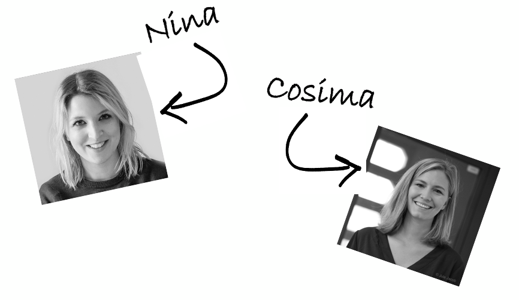
<br><br><br><br><br><br>Wir sind ein deutschlandweites Netzwerk von über 1300 Data Scientists, die die Welt durch Data Science verbessern wollen. 
**#MetaWeltretter**
]

---

## Agenda

1. **Vorstellung** (5 Minuten)
<br>

2. **Allgemeine Einführung** (20 Minuten)
<br>

3. **Übung 1-5 gemeinsam** (35 Minuten)
  - Übung durchlaufen lassen
  - Lösung durchlaufen lassen
<br>

4. **Pause** (5 Minuten)
<br>

5. **Übung 6-10 Peer Learning in Break Outs** (40 Minuten)
<br>

6. **Hosting, Ausblick, Weiterbildung** (10 Minuten)
<br>

7. **Evaluation** (5 Minuten)
<br>

8. **Kaffeeplausch** (60 Minuten)

---
class: inverse, middle, center
background-image: url("libs/img/red.png")
background-position: 0% 100%;
background-size: cover

# Und wer seid Ihr?

---
class: bg_img, hide-logo, progress-bar-hide

.full-width[.content-box-grey[
## Spielregeln für unsere Zusammenarbeit
<br><br>

1. Fragen gerne immer am Chat bzw. zum Ende der einzelnen Abschnitte
<br><br>

2. Aktiv und gemeinsam Neues lernen
<br><br>

3. Praktisch arbeiten statt Theorien wiederholen
<br><br><br><br>
]]
---
## Ziele des Workshops  

<br><br>

- Anwendungsmöglichkeiten für die Technologie RShiny erkennen
<br><br>

- Code zu lesen
<br><br>

- Grundverständnis für die technische Implementierung
<br><br>

- Gewecktes Interesse mehr zu lernen

---
## Prinzipien des Workshops

<br><br>

- Alle Pflichtaufgaben können durch das Kopieren von Codesegmenten mit kleinen Änderungen erledigt werden
<br><br>

- Bitte lest die Aufgabenstellungen gründlich durch (##### Übung X)
<br><br>

- Grüner Text kennzeichnet Kommentare, in denen wichtige Informationen für Euch stehen

---
class: inverse, middle, center
background-image: url("libs/img/blue.png")
background-position: 0% 100%;
background-size: cover

# Web-Applikationen begegnen uns überall – doch was ist das eigentlich?

---
### Visualisierung von Covid-19-Daten

[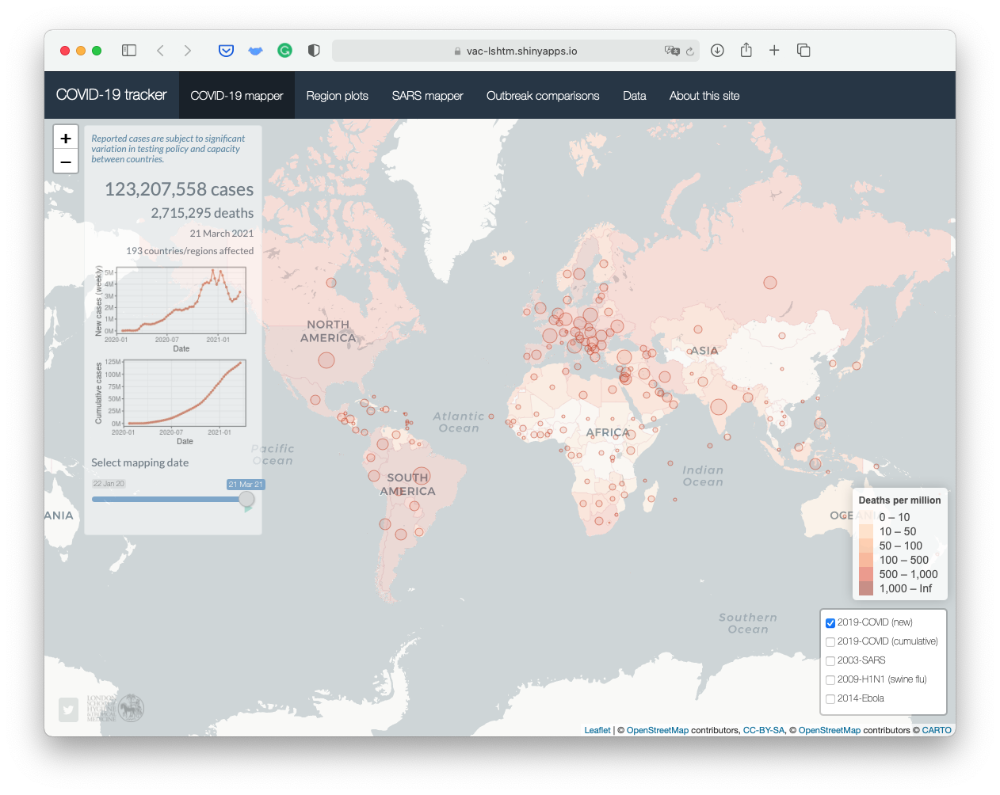](https://vac-lshtm.shinyapps.io/ncov_tracker/?_ga=2.169619937.1955604536.1616424760-1179854739.1615478835)

---

### Suchmaschine (1)

[](https://cosima-meyer.shinyapps.io/coro2vid-19-shinyapp/)

---

### Suchmaschine (2)

[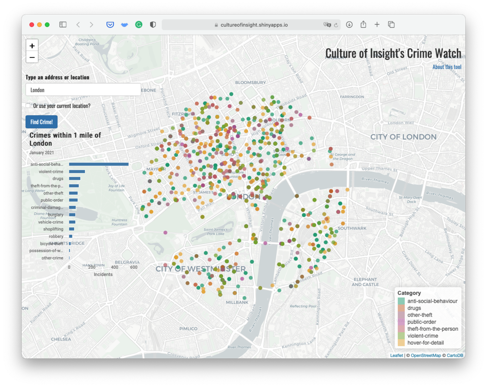](https://cultureofinsight.shinyapps.io/crime-watch/?_ga=2.173579619.1955604536.1616424760-1179854739.1615478835)


---

### Und so viel mehr...

[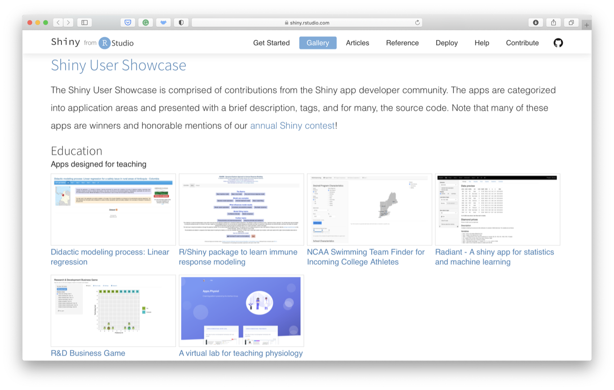](https://shiny.rstudio.com/gallery/)

---

## Und was ist Shiny?

Ein R-Package, das es Euch ermöglicht ganz leicht interaktive Web-Applikationen zu bauen 
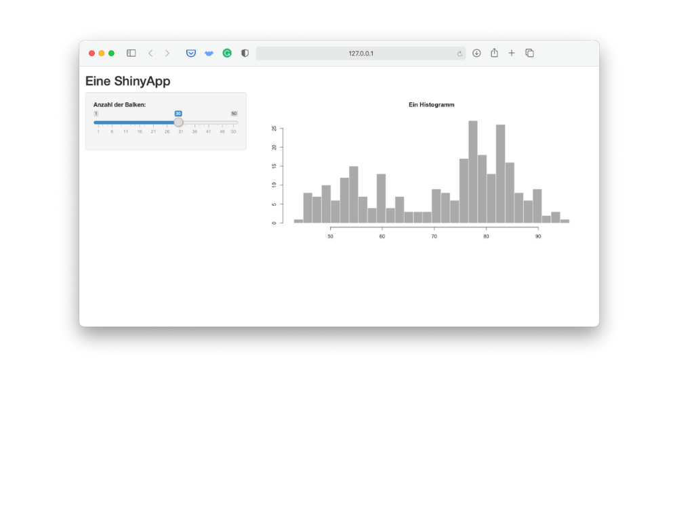

---

## Und was ist Shiny?
Ein R-Package, das es Euch ermöglicht ganz leicht interaktive Web-Applikationen zu bauen 
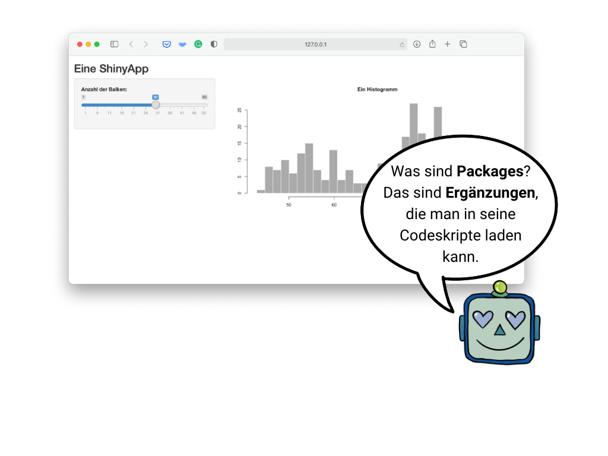

---
class: inverse, middle, center
background-image: url("libs/img/red.png")
background-position: 0% 100%;
background-size: cover

# Wie erstelle ich eine ShinyApp in R?


---
class: inverse, center, middle

```{r xaringanExtra-freezeframe, echo=FALSE}
xaringanExtra::use_freezeframe()
```


---

# Aufsetzen einer ShinyApp


---

# Aufsetzen einer ShinyApp


---

# Aufsetzen einer ShinyApp

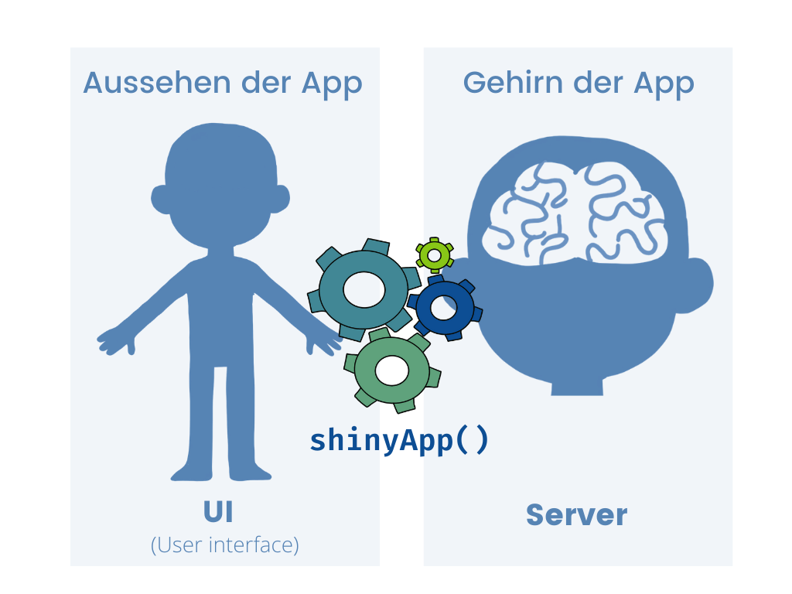

---
class: hide-logo
background-image: url("libs/img/fullbody.png")
background-size: 120px
background-position: 95% 8%

### `ui.R` 

Bestimmt das **Aussehen** der App

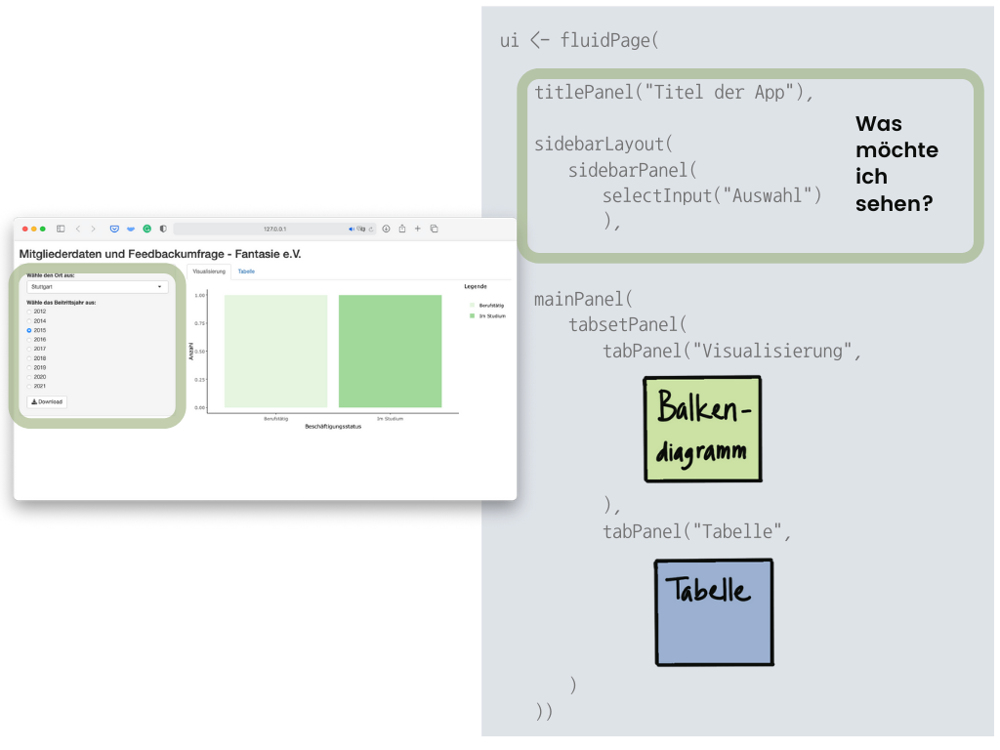

---
class: hide-logo
background-image: url("libs/img/fullbody.png")
background-size: 120px
background-position: 95% 8%

### `ui.R` 

Bestimmt das **Aussehen** der App

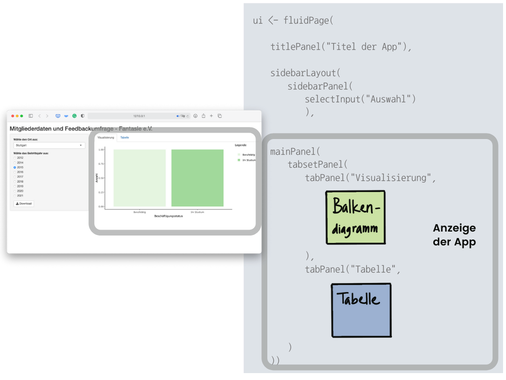

---
class: hide-logo
background-image: url("libs/img/head.png")
background-size: 200px
background-position: 95% 8%

### `server.R` 

Kreiert das **Gehirn** der App

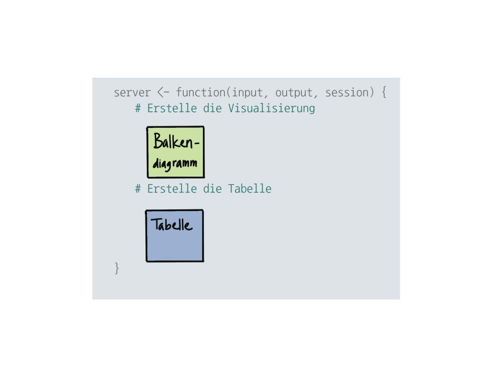

---
## Alles muss miteinander verbunden sein

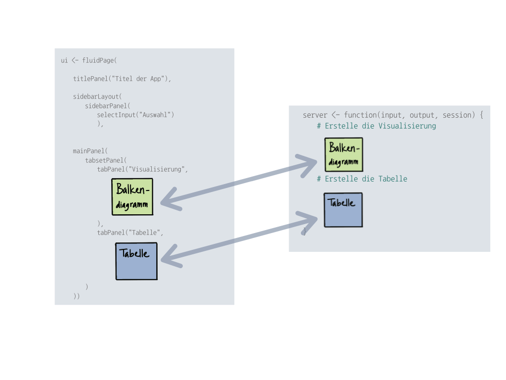

---
### `shinyApp()`

**Als letzter Schritt:**
<br>

Das **UI** mit dem **Server** kombinieren
<br>  <br>  <br>  <br>  

.center[
```{r, eval=FALSE}
shinyApp(ui = ui, server = server)
```
]

---

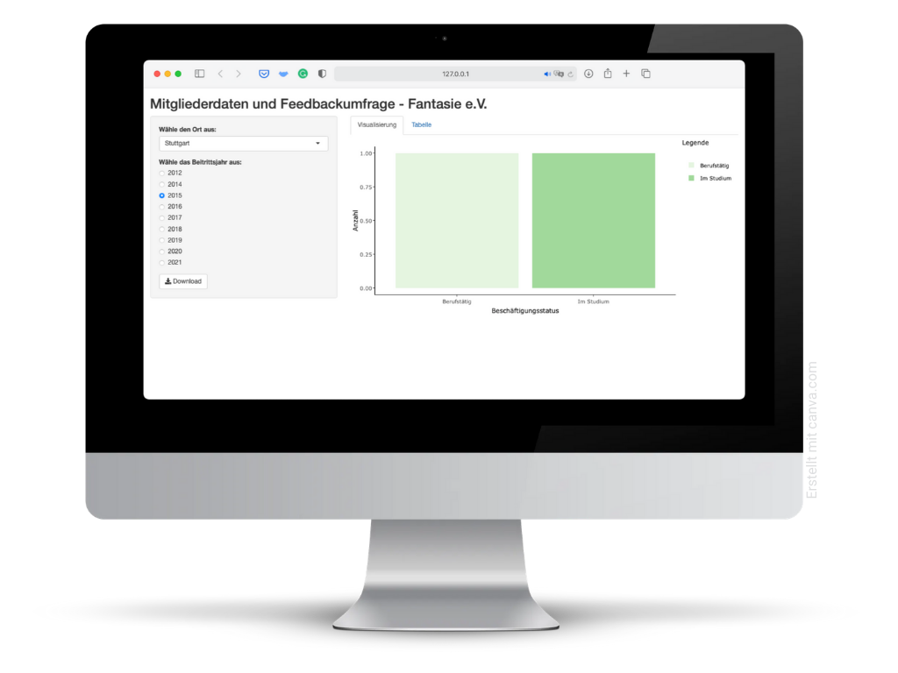

---
class: inverse, center, middle

# Jetzt bauen wir Eure erste ShinyApp
<span style="font-size:8em">💻</span>

---
class: inverse, center, middle

## Alles was Ihr braucht

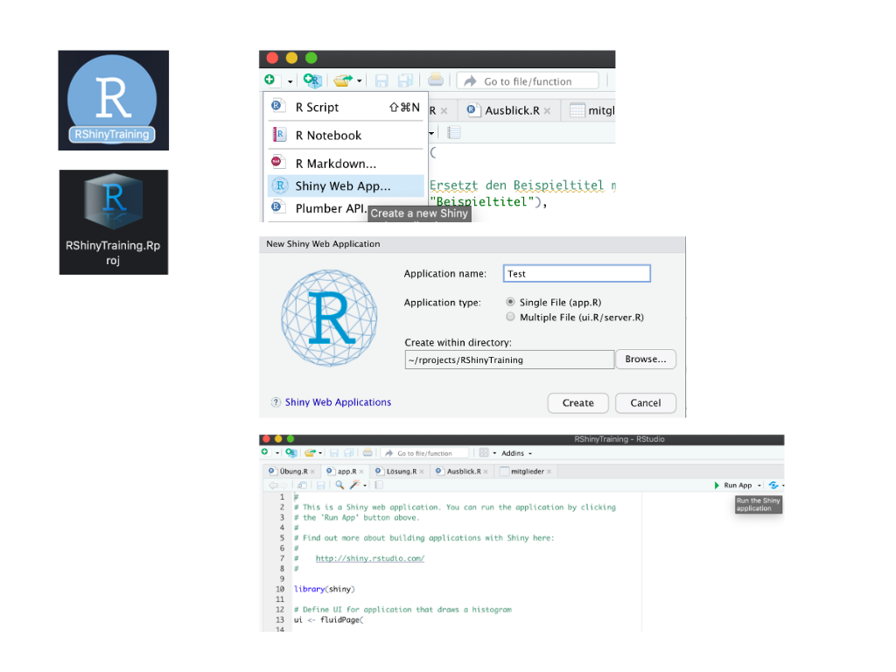

---
### Und jetzt? Ihr könnt den Code ganz leicht auf andere Projekte übertragen...

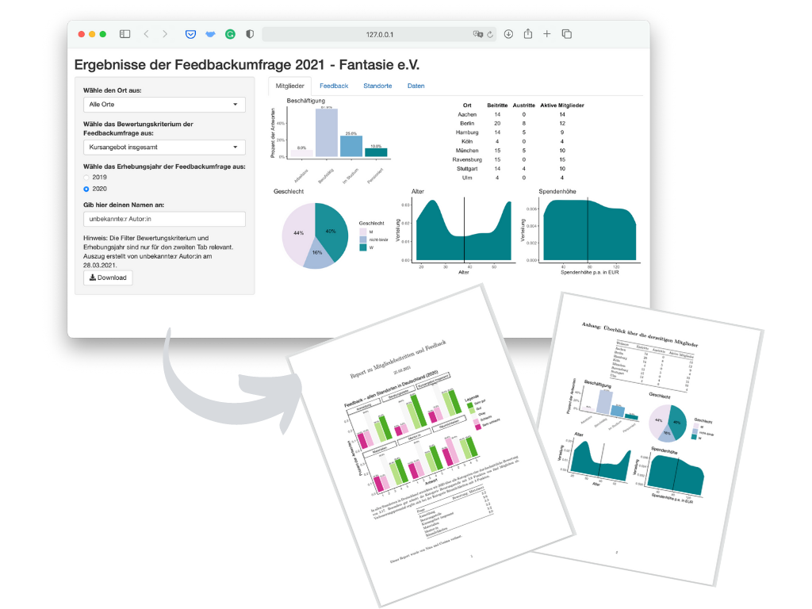

---
### Oder Eure ShinyApp veröffentlichen

- Mit unsensiblen Daten kann man die ShinyApp ganz einfach und kostenlos über [**shinyapp.ios**](http://www.shinyapps.io/?_ga=2.133360206.1145896271.1604733011-115282237.1604416772) veröffentlichen

- Vor dem Veröffentlichen auf jeden Fall beachten: Alle Packages müssen installiert sein (mit `install.packages(...)`) -- das darf allerdings nicht im Code erscheinen.
  
- Schritt-für-Schritt-Anleitung:
  1. Installiert ```rsconnect``` (`install.packages('rsconnect')`)
  2. Erstellt ein kostenloses Benutzerkonto auf [**shinyapps.io**](http://www.shinyapps.io/?_ga=2.133360206.1145896271.1604733011-115282237.1604416772)
  3. Folgt Methode 1 wie [**hier**](https://shiny.rstudio.com/articles/shinyapps.html) beschrieben: Kopiert das Token und fügt es in Euer RStudio ein
  4. (Wenn Ihr die App vorab noch einmal testen wollt: `runApp()`)
  5. Zum Schluss: Veröffentlicht Eure ShinyApp mit `deployApp()`

Einen kleinen Moment warten... **und das war's! Eure App ist online!**

---
class: inverse

## Online findet Ihr tolle Weiterbildungsformate, ...

[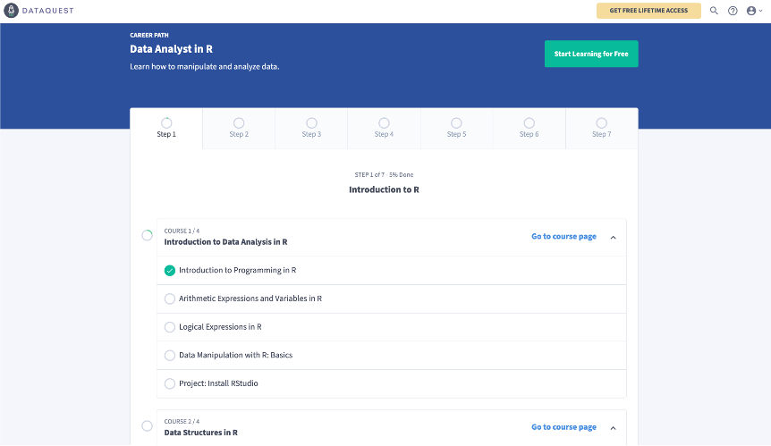](https://www.dataquest.io)

---
class: inverse
background-image: url("libs/img/computer.png")
background-size: 200px
background-position: 95% 8%

<br><br><br>
## ... noch mehr Ressourcen

.pull-left[.small[
- Shiny

  - [R Studio Tutorial](https://shiny.rstudio.com/tutorial/)
  - [Hadley Wickham: "Mastering Shiny"](https://mastering-shiny.org)
  - [Konstantin Gavras and Nick Baumann: "Shiny Apps: Development and Deployment"](https://www.mzes.uni-mannheim.de/socialsciencedatalab/article/shiny-apps/) auf Methods Bites
  - [Julie Scholler: "Intro to Shiny Web App"](https://juliescholler.gitlab.io/files/M2/M2-CM3-Shiny.html#1)
  - [Kaleen L. Medeiros: "Introduction to Shiny"](https://github.com/klmedeiros/rladies-tunisia-july2020-intro-shiny)
  - [Garrett Grolemund: "How to understand reactivity in R"](https://shiny.rstudio.com/articles/understanding-reactivity.html)
]]
  
.pull-right[.small[
- ShinyApps hosten
  - [Hosting and deployment](https://shiny.rstudio.com/articles/shinyapps.html)
  - [Shinyapps.io - Step-by-step guide](https://shiny.rstudio.com/articles/shinyapps.html)

- Shiny dashboards
  - [R Studio tutorial](https://rstudio.github.io/shinydashboard/)
  - [Themes](https://github.com/nik01010/dashboardthemes)

- Optimieren von ShinyApps
  - [Make your ShinyApp faster](https://appsilon.com/r-shiny-faster-updateinput-css-javascript/)
  - [shiny.worker](https://www.r-bloggers.com/shiny-worker-speed-up-r-shiny-apps-by-offloading-heavy-calculations/)
  
- Visualisierungen leicht erstellen
  - [Per Click-and-Drop mit "esquisse"](https://cran.r-project.org/web/packages/esquisse/vignettes/get-started.html)
]]

---
class: inverse

## ... und natürlich Angebote bei CorrelAid!

<br>
![:col_row , , ]
<br>
![:col_row <b>PROJEKTE</b>, <b>BILDUNG</b>, <b>DIALOG</b>]
<br>
![:col_row Wir führen pro-bono Datenanalyseprojekte für gemeinnützige Organisationen durch., Wir vernetzen engagierte sozial denkende Datenanalyst:innen und bieten ihnen Möglichkeiten ihr Wissen anzuwenden und zu erweitern., Wir treten in den Dialog über den Wert und Nutzen von Daten und Datenanalysen für das Gemeinwohl.]


---
class: inverse, middle, center


`r fontawesome::fa(name = "globe", fill = "white")` [correlaid.org](https://correlaid.org) 

`r fontawesome::fa(name = "twitter", fill = "white")` [@CorrelAid](https://twitter.com/correlaid?lang=en)

`r fontawesome::fa(name = "linkedin", fill = "white")` [correlaid](https://www.linkedin.com/company/correlaid/)
