```{r load_packages, message=FALSE, warning=FALSE, include=FALSE} 
# devtools::install_github("rstudio/fontawesome")

library(fontawesome)
library(dplyr)
library(ggplot2)
library(zoo)
library(flipbookr)


options(htmltools.dir.version = FALSE)

library(xaringanthemer)
# style_mono_accent(
#   base_color = "#283444",
style_mono_accent(base_color = "#283444",
  header_font_google = google_font("Josefin Sans"),
  text_font_google   = google_font("Helvetica", "300", "300i"),
  code_font_google   = google_font("Fira Mono")
)

library(quanteda) # For NLP

load("data/UN-data.RData")

mycorpus <- corpus(un_data)

# Assigns a unique identifier to each text
docvars(mycorpus, "Textno") <-
  sprintf("%02d", 1:ndoc(mycorpus)) 

# Create tokens
token <-
  tokens(
    mycorpus,
    remove_numbers = TRUE,
    remove_punct = TRUE,
    remove_symbols = TRUE,
    remove_url = TRUE,
    split_hyphens = TRUE,
    include_docvars = TRUE
  )

# Clean tokens created by OCR
token_ungd <- tokens_select(
  token,
  c("[\\d-]", "[[:punct:]]", "^.{1,2}$"),
  selection = "remove",
  valuetype = "regex",
  verbose = TRUE
)

mydfm <- dfm(token_ungd,
             tolower = TRUE,
             stem = TRUE,
             remove = stopwords("english")
             )

mydfm.trim <-
  dfm_trim(
    mydfm,
    min_docfreq = 0.075,
    # min 7.5%
    max_docfreq = 0.90,
    #  max 90%
    docfreq_type = "prop"
  ) 


```


class: inverse, middle, center


`r fontawesome::fa(name = "github", fill = "white")` Code and slides at </br></br>
[bit.ly/nlp-talk](http://bit.ly/nlp-talk)

---
## Researcher and data lover


.left-column[
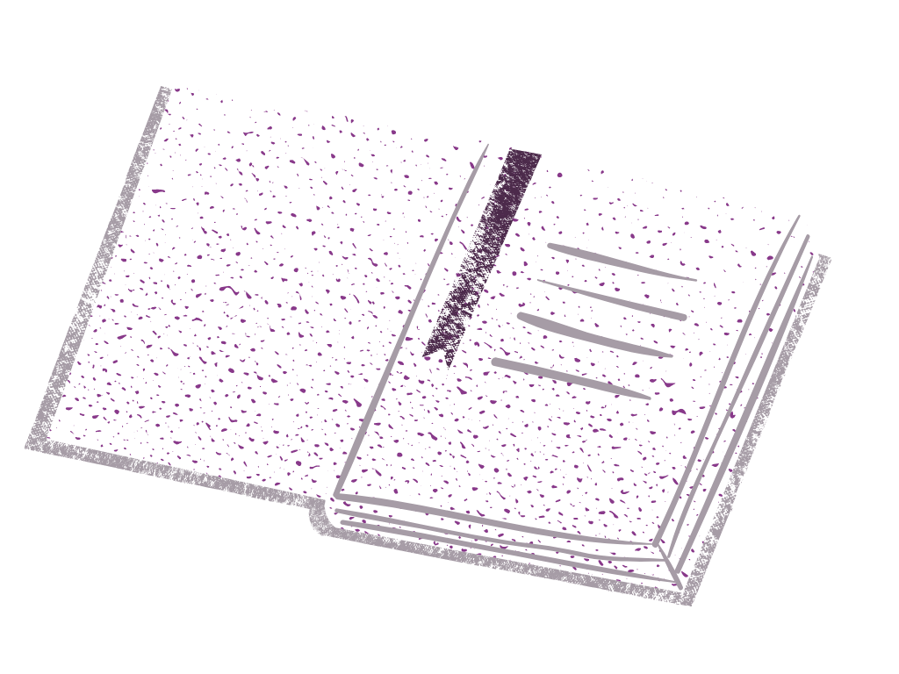
<br>

 

<br>


]

.right-column[
**PhD Candidate** and **researcher** at the University of Mannheim

<br><br><br>
**Co-founder** and **co-editor** of the data science blog [**Methods Bites**](https://www.mzes.uni-mannheim.de/socialsciencedatalab/)

<br><br><br><br><br>
**Maintainer** and **author** of the CRAN package [**overviewR**](https://cosimameyer.github.io/overviewR/)
]

---

layout: true
.footer[bit.ly/nlp-talk]

---

## Where do you find text data?

- Short answer: **everywhere!**
</br>
</br>
</br>
- It can be a speech, a peace agreement, a treaty, a newspaper article, a diary report, an open survey answer, some archival notes, tweets, website text, ... 


---

## What is text data?

.pull-left[

]

.pull-right[
Text data can be **documents**
]
---

## What is text data?

.pull-left[
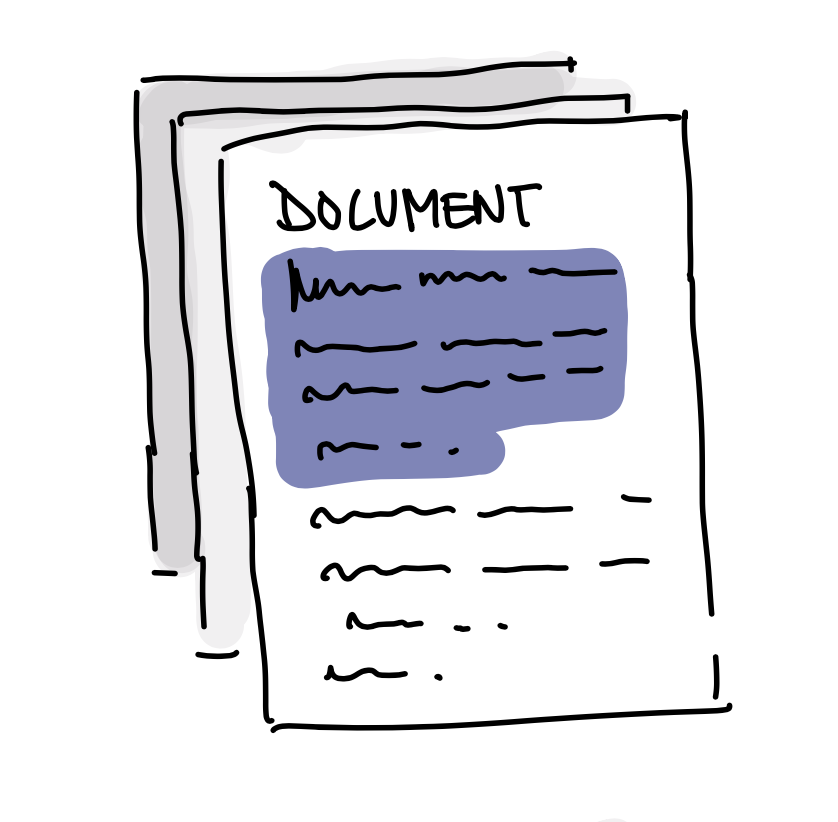
]

.pull-right[
Text data can be documents, **paragraphs**
]
---

## What is text data?

.pull-left[
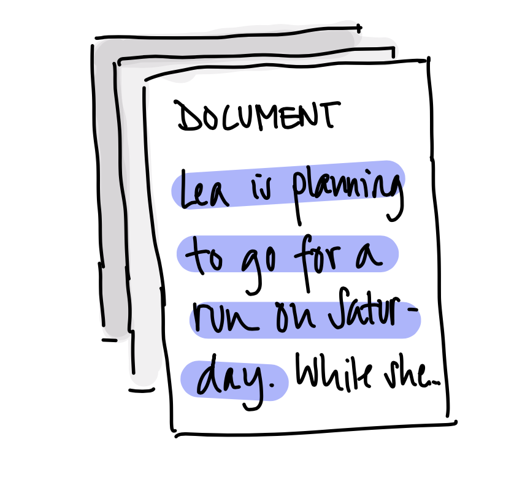
]

.pull-right[
Text data can be documents, paragraphs, **sentences**
]
---

## What is text data?

.pull-left[
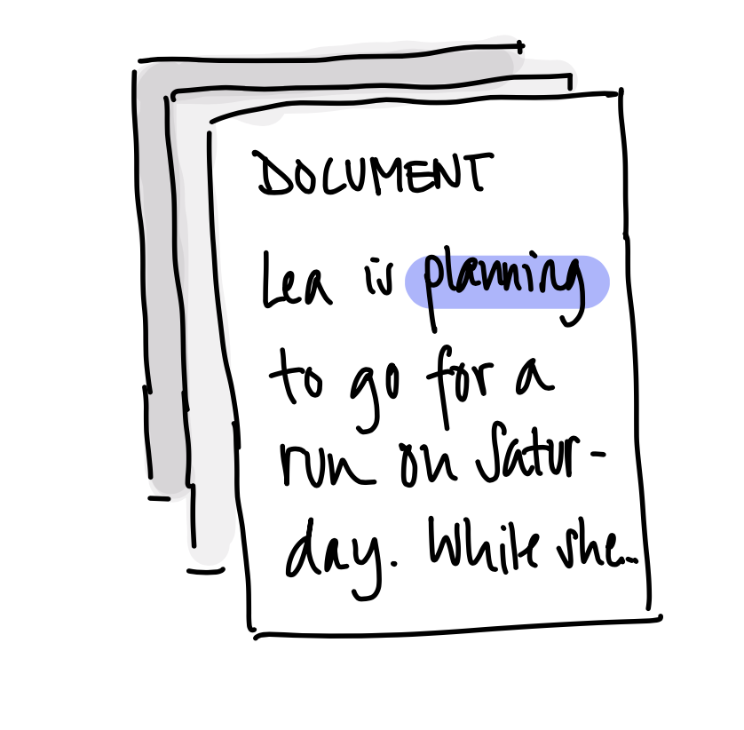
]

.pull-right[
Text data can be documents, paragraphs, sentences or also **single words**
]

---

## What is text data?
.pull-left[
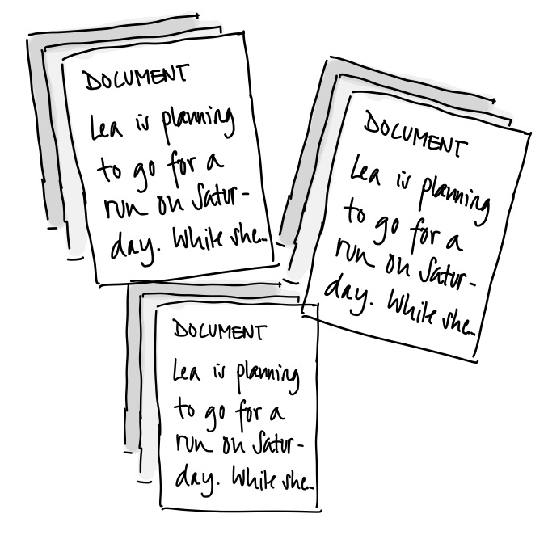
]
.pull-right[
**Corpus**: collection of documents
]
---
## What is text data?
.pull-left[


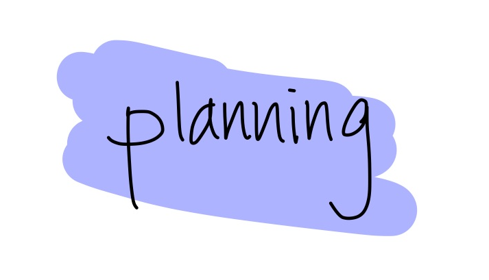
]
.pull-right[
**Corpus**: collection of documents
</br>
</br>
</br>
</br>
</br>
</br>
</br>
</br>
</br>
</br>
</br>
**Tokens**: each individual word in a text (but it could also be a sentence, paragraph, or character)
]

---

## What is text data?


.pull-left[
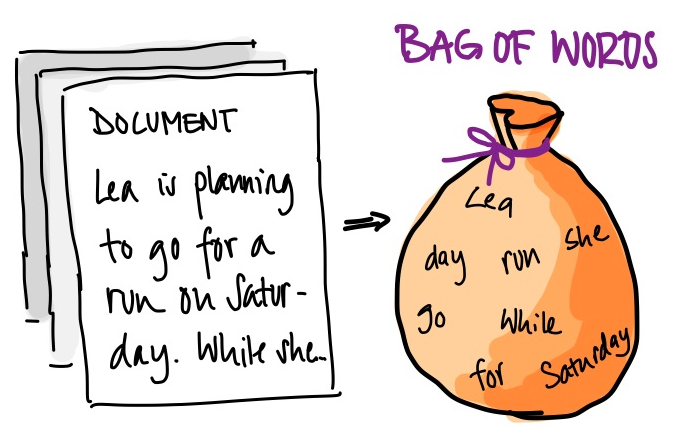
]
.pull-right[
**Tokenization**: Creating a **bag of words**
]

---

## What is text data?


.pull-left[


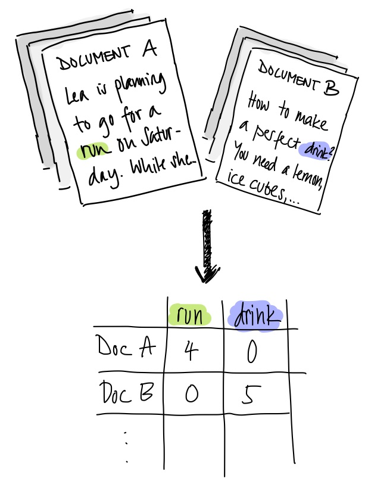
]
.pull-right[
**Tokenization**: Creating a **bag of words**
</br>
</br>
</br>
</br>
</br>
</br>
</br>
</br>
**Document-feature matrix (DFM)**: First split the text into its single terms (tokens), then count how frequently each token occurs in each document
]

---

## What is text data?

.pull-left[
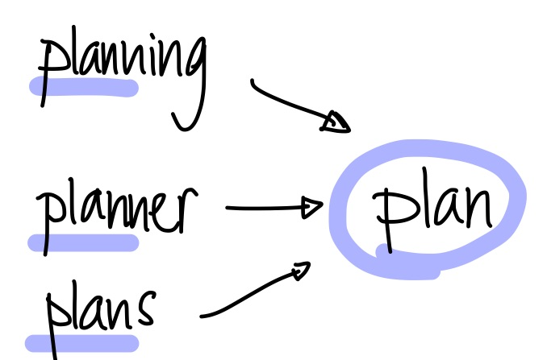
]

.pull-right[
**Stemming**: Getting the stem of the word
]
---
## What is text data?

.pull-left[

</br>
</br>

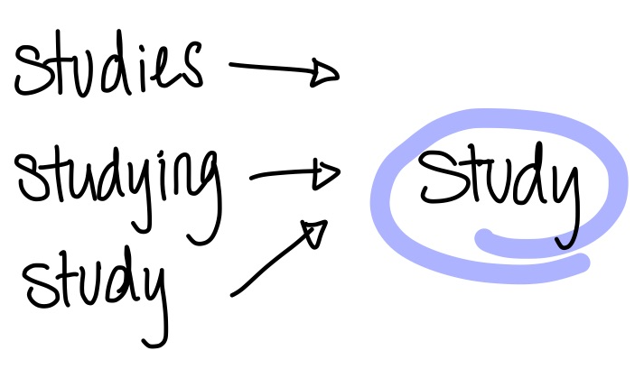
]
.pull-right[
**Stemming**: Getting the stem of the word
</br>
</br>
</br>
</br>
</br>
</br>
</br>
</br>
**Lemmatization**: Getting the meaningful stem of the word
]

---

layout: false

---
## Speeches at the UNGD

.centering[]
<center><small>Photo taken by me (October 2019)</small></center> 

Speeches are based on the data set by [**Mikhaylov et al. (2017)**](https://doi.org/10.7910/DVN/0TJX8Y)

---

layout: true
.footer[bit.ly/nlp-talk]

---
class: inverse
background-image: url("overview.png")
background-size: 600px

---

class: inverse
background-image: url("overview2.png")
background-size: 600px

---

class: inverse
background-image: url("overview3.png")
background-size: 600px

---

class: inverse
background-image: url("overview4.png")
background-size: 600px

---

class: inverse
background-image: url("overview5.png")
background-size: 600px

---
class: inverse, center, middle

# Quanteda

---

## Quanteda

- `quanteda`: **qu**antitative **an**alysis of **te**xtual **da**ta
  - Fully-featured package that allows you to easily perform NLP tasks

- What are alternatives?
  - `tm`: simpler grammar but fewer features

  - `tidytext`: good integration with the `tidyverse`

  - `koRpus`: good for part-of-speech tagging

---

## How do we use quanteda?

1) **Import** the data 

2) Build a **corpus**

3) **Pre-process your data**

4) Calculate a **document-feature matrix** (DFM)
--
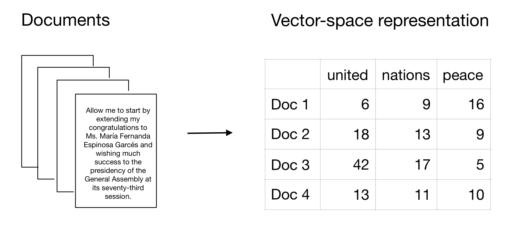
<center><small><a href="https://www.mzes.uni-mannheim.de/socialsciencedatalab/article/advancing-text-mining/#stm">Methods Bites (2019)</a></small></center> 

---
## How do we use quanteda?

1) **Import** the data 

```{r, eval=FALSE}
# Load packages
library(quanteda) # For NLP

load("UN-data.RData")
```

---
## How do we use quanteda?

2) Build a **corpus**

```{r, eval=FALSE}

mycorpus <- corpus(un_data)

# Assigns a unique identifier to each text
docvars(mycorpus, "Textno") <-
  sprintf("%02d", 1:ndoc(mycorpus)) 
```

---
## How do we use quanteda?

3) **Preprocess the text**

.pull-left[Steps in the pre-processing world:

- Remove numbers
- Remove punctuation
- Remove symbols
- Remove URLS
- Remove hyphens
- But keep doc vars
]
.pull-right[
```{r, eval=FALSE}

# Create tokens
token <-
  tokens(
    mycorpus,
    remove_numbers = TRUE,
    remove_punct = TRUE,
    remove_symbols = TRUE,
    remove_url = TRUE,
    split_hyphens = TRUE,
    include_docvars = TRUE
  )
```
]

---
## How do we use quanteda?

```{r}
# Clean tokens created by OCR
token_ungd <- tokens_select(
  token,
  c("[\\d-]", "[[:punct:]]", "^.{1,2}$"),
  selection = "remove",
  valuetype = "regex",
  verbose = TRUE
)
```

---
layout: false

---
## How do we use quanteda?

4) Calculate a **document-feature matrix** (DFM)

.pull-left[Here, we also:

- Lower the text
- Stem the words
- remove stop words
]
.pull-right[
```{r, eval=FALSE}
mydfm <- dfm(
  token_ungd,
  tolower = TRUE,
  stem = TRUE,
  remove =
    stopwords("english")
)
```
]
--
```{r, eval =FALSE}
head(mydfm)
```
--
```
Document-feature matrix of: 6 documents, 19,265 features (96.6% sparse) 
                            and 4 docvars.
                 features
docs              way assembl hall inform suprem state council islam 
  AFG_55_2000.txt   1       8    1      2      1    14       9    16 
  AGO_55_2000.txt   5       2    0      0      0     2       5     0 
  ALB_55_2000.txt   2       1    0      0      0     1       2     0 
  AND_55_2000.txt   2       2    1      1      0     7       1     0 
  ARE_55_2000.txt   0       2    0      1      0    10       6     4 
  ARG_55_2000.txt   4       4    0      1      0    11       7     0 
```


---
layout: true
.footer[bit.ly/nlp-talk]

---

## How do we use quanteda?

Trim the words: remove all the words that appear less than 7.5% of the time and more than 90% of the time

```{r}
mydfm.trim <-
  dfm_trim(
    mydfm,
    min_docfreq = 0.075,
    # min 7.5%
    max_docfreq = 0.90,
    #  max 90%
    docfreq_type = "prop"
  ) 
```

---
## Visualizing text data
.pull-left[
```{r, eval=FALSE}
quanteda::textplot_wordcloud(
  mydfm,
  min_count = 3,
  max_words = 500,
  color = "darkblue"
)
```
]
.pull-right[
```{r, echo=FALSE}
quanteda::textplot_wordcloud(
  mydfm,
  min_count = 3,
  max_words = 500,
  color = "darkblue"
)
```
]

---
class: inverse, center, middle

# Supervised approaches

---

## Supervised approach:</br></br>Dictionary-based approach and sentiment analysis

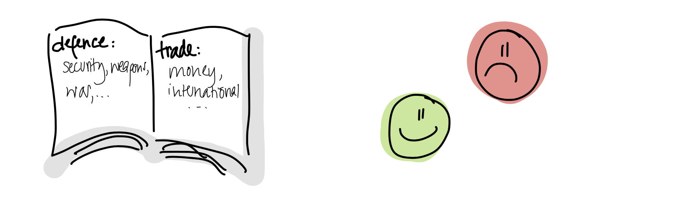
---

### Supervised approach:</br>Dictionary-based approach

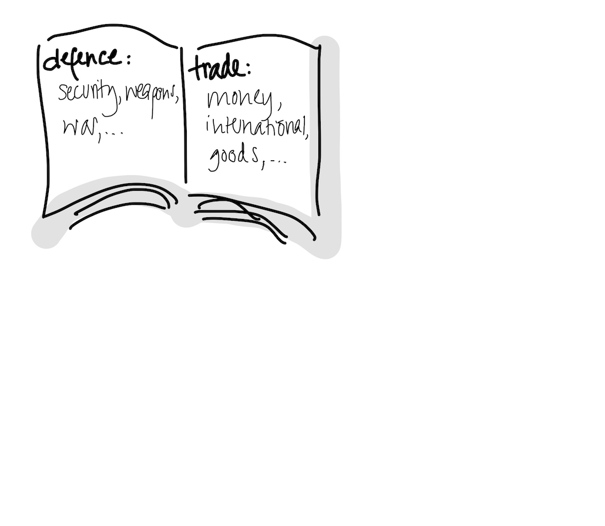

---

### Supervised approach:</br>Dictionary-based approach

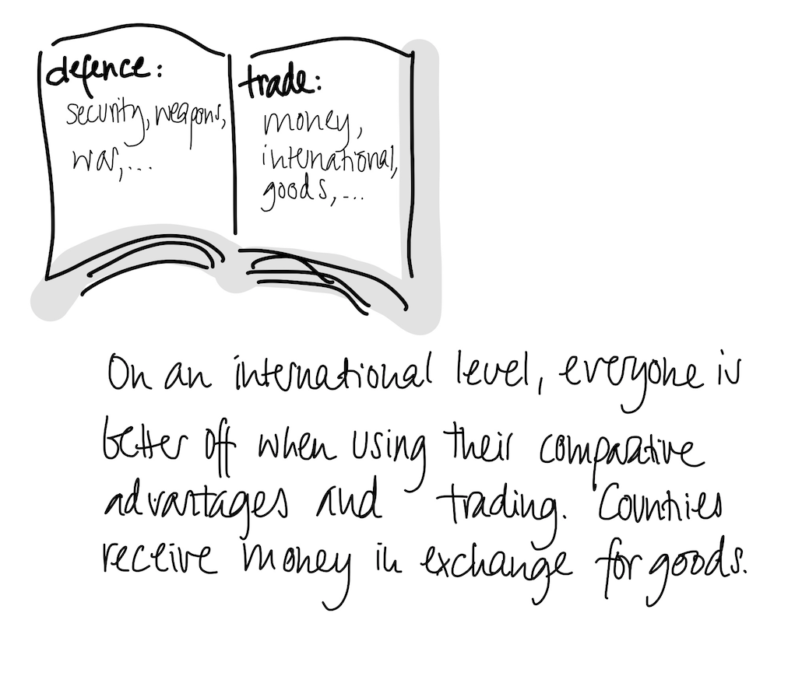

---

### Supervised approach:</br>Dictionary-based approach

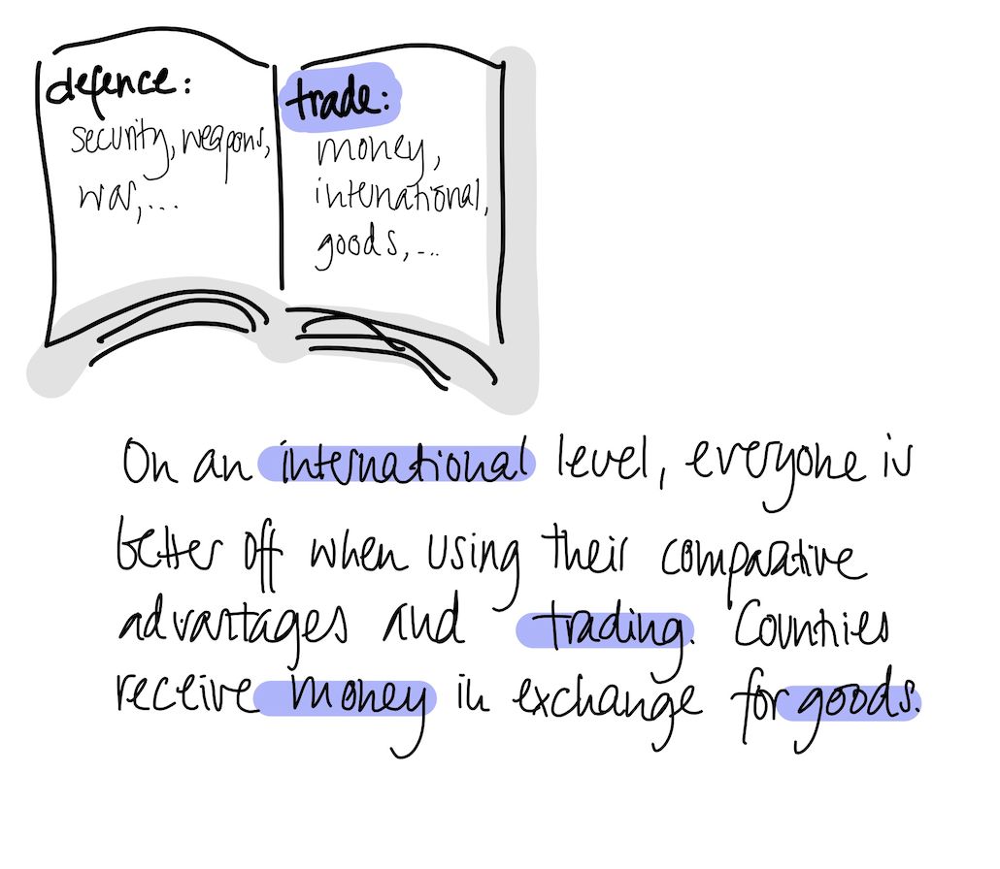
---

### Supervised approach:</br>Dictionary-based approach

.pull-left[

]
.pull-right[
```{r, eval =FALSE}
# Define dictionary
dict <- dictionary(file =
                     "dict")

# Apply the dictionary to our DFM
dfm_dict <- dfm(mydfm.trim,
                groups =
                  "country",
                dictionary =
                  dict)
```

]

---
layout: false

---

### Supervised approach:</br>Dictionary-based approach

.pull-left[

]
.pull-right[
```{r, eval =FALSE}
# Define dictionary
dict <- dictionary(file =
                     "dict")

# Apply the dictionary to our DFM
dfm_dict <- dfm(mydfm.trim,
                groups =
                  "country",
                dictionary =
                  dict)
```

]
```{r, eval = FALSE}
head(dfm_dict)
```

```
Document-feature matrix of: 6 documents, 28 features (35.7% sparse) 
and 1 docvar.
     features
docs  macroeconomics civil_rights healthcare agriculture 
  AFG              3           14         13           0     
  AGO             11            4         10           0    

```

---
layout: true
.footer[bit.ly/nlp-talk]

---

### Supervised approach:</br>Sentiment analysis

Works often in a similar way as the dictionary-based approach

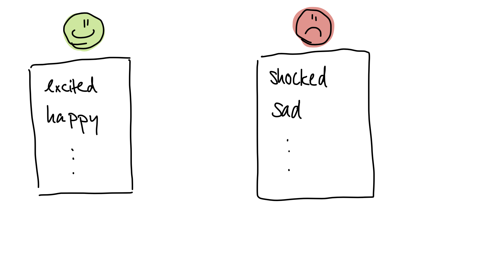

---

### Supervised approach:</br>Sentiment analysis

Works often in a similar way as the dictionary-based approach

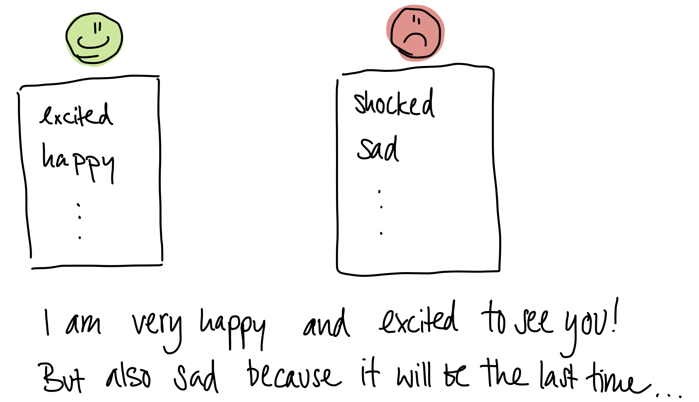
---

### Supervised approach:</br>Sentiment analysis

Works often in a similar way as the dictionary-based approach

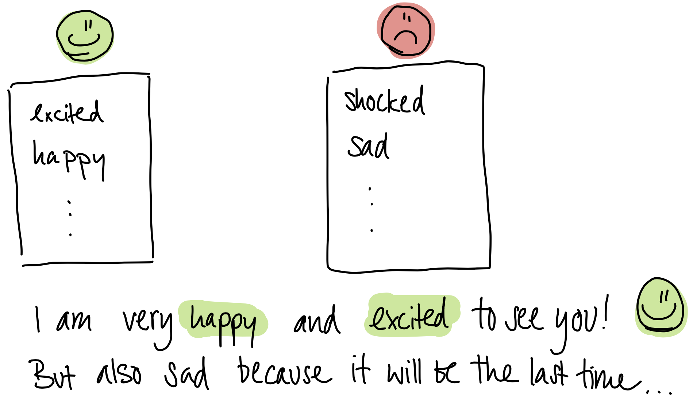
---

### Supervised approach:</br>Sentiment analysis

Works often in a similar way as the dictionary-based approach

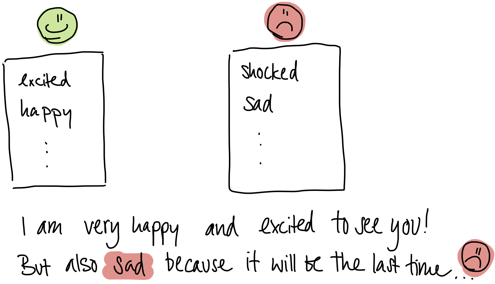
---
layout: false
---
### Supervised approach:</br>Sentiment analysis

.pull-left[

]
.pull-right[
```{r, eval =FALSE}
# Call a dictionary
dict <- data_dictionary_LSD2015

dfmat_lsd <-
  dfm(mydfm.trim,
      dictionary =
        dict[1:2])
```
]


---
### Supervised approach:</br>Sentiment analysis

.pull-left[

]
.pull-right[
```{r, eval =FALSE}
# Call a dictionary
dict <- data_dictionary_LSD2015

dfmat_lsd <-
  dfm(mydfm.trim,
      dictionary =
        dict[1:2])
```
]

```{r, eval =FALSE}
head(dfmat_lsd, 2)
```

```
Document-feature matrix of: 2 documents, 
2 features (0.0% sparse) and 4 docvars.

                 features
docs              negative positive
  AFG_55_2000.txt       84       68
  AGO_55_2000.txt       88       95
```
---
class: inverse, center, middle

# Unsupervised approaches

---
layout: true
.footer[bit.ly/nlp-talk]

---


## Unsupervised approach:</br>Topic models

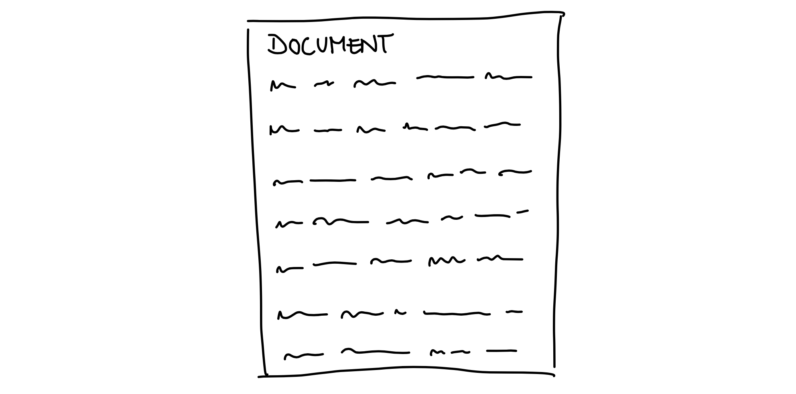

???
- TM: unsupervised machine learning technique
- the main idea: they discover the "main theme" of what you have in a topic

- capable of scanning a set of documents, detecting word and phrase patterns within them
- automatically clusters word groups and similar expressions that best characterize a set of documents

- in a nutshell: detect topics from texts

---

## Unsupervised approach:</br>Topic models

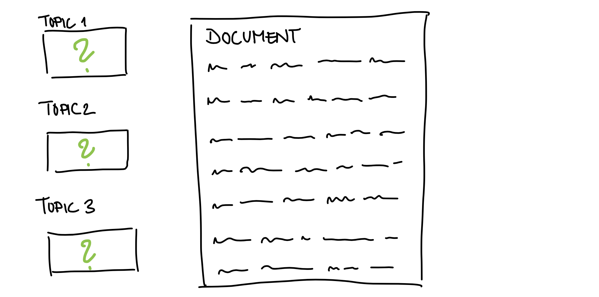

---

## Unsupervised approach:</br>Topic models

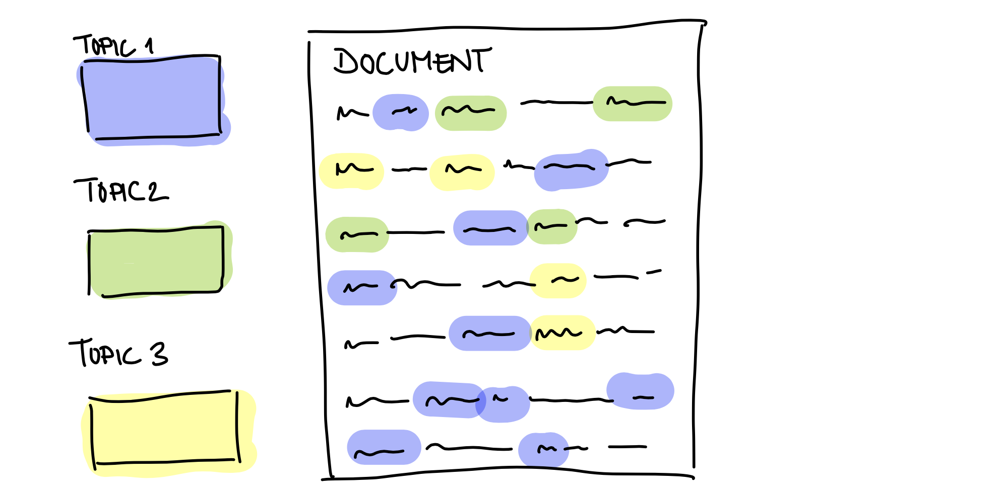

---

## Unsupervised approach:</br>Topic models

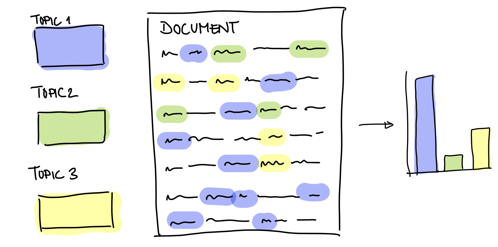

---

## Unsupervised approach:</br>Topic models

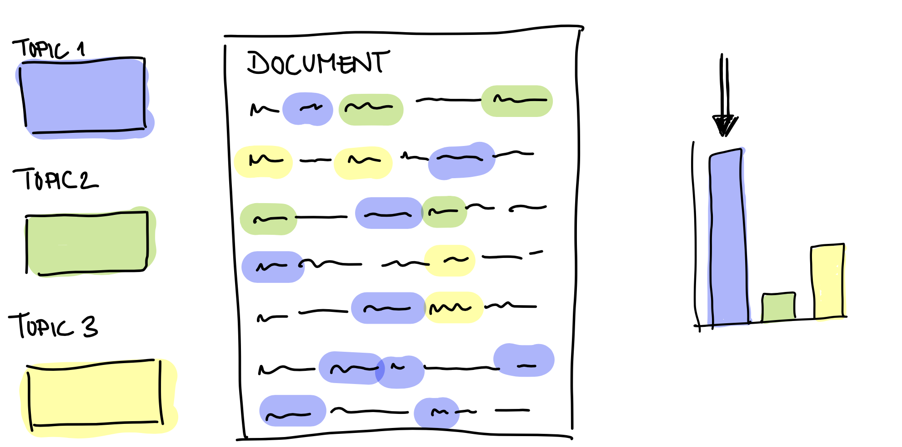
---

## Unsupervised approach:</br>Topic models

- [**Latent Dirichlet Allocation (LDA)**](https://towardsdatascience.com/light-on-math-machine-learning-intuitive-guide-to-latent-dirichlet-allocation-437c81220158) 


- [**Structural Topic Models**](http://www.luigicurini.com/uploads/6/7/9/8/67985527/stm_paper_ajps12103.pdf): extension of LDA but takes other context variables (e.g., information about the document) into account

???
Intuition behind LDA/TM: 
Each document can be described by a distribution of topics
and each topic can be described by a distribution of words

---

## Unsupervised approach:</br>Topic models
.pull-left[
]
.pull-right[
```{r, eval = FALSE}
# Load package
library(stm)

# Assigns the number of topics
topic.count <- 5

dfm2stm <- convert(mydfm.trim,
                   to = "stm")

model.stm <- stm(
  dfm2stm$documents,
  dfm2stm$vocab,
  K = topic.count,
  data = dfm2stm$meta,
  init.type = "Spectral"
)
```
]
---
class: inverse, center, middle

# How can you use NLP in your life?

---
## Build your own search engine...

[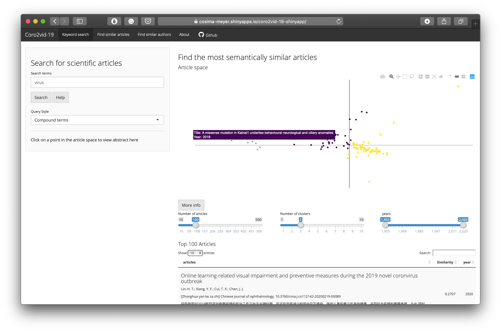](https://cosima-meyer.shinyapps.io/coro2vid-19-shinyapp/)

---
## ... or your own chat bot

[](https://medium.com/@kumaramanjha2901/building-a-chatbot-in-python-using-chatterbot-and-deploying-it-on-web-7a66871e1d9b)

<!-- --- -->
<!-- class: inverse, center, middle -->

<!-- # And in your research? -->

<!-- --- -->

<!-- Give example of where the money blows paper -->

<!-- --- -->

<!-- Give example of computer vision --> topic classification -->

<!-- --- -->

<!-- Give example of CorrelAid project: converting audio files into text -- and analyze is -->

---
class: inverse
background-image: url("computer2.png")
background-size: 200px
background-position: 95% 8%

<br><br><br>
# More resources 

.pull-left[.small[
- Quanteda

  - [Kohei Watanabe and Stefan Müller: Quanteda Tutorials](https://tutorials.quanteda.io)

- More on text mining
  - [Cosima Meyer and Cornelius Puschmann: Advancing Text Mining with R and quanteda](https://www.mzes.uni-mannheim.de/socialsciencedatalab/article/advancing-text-mining/)

]]
  
.pull-right[.small[
- Sentiment analysis
  - [sentimentr](https://github.com/trinker/sentimentr)
  - [Hammerschmidt/Meyer 2020: Money Makes the World Go Frowned - Analyzing the Impact of Chinese Foreign Aid on States' Sentiment Using Natural Language Processing](https://www.tectum-shop.de/titel/chinas-rolle-in-einer-neuen-weltordnung-id-97867/)

- Model validation
  - [oolong: Validation of dictionary approaches and topic models](https://cran.r-project.org/web/packages/oolong/index.html)
  - [stminsights](https://github.com/cschwem2er/stminsights)
]]


---
layout: false

---
class: inverse, middle, center


`r fontawesome::fa(name = "twitter", fill = "white")` [@cosima_meyer](https://twitter.com/cosima_meyer)

`r fontawesome::fa(name = "linkedin", fill = "white")` [cosimameyer](https://www.linkedin.com/in/cosimameyer/)

`r fontawesome::fa(name = "globe", fill = "white")` [cosimameyer.rbind.io](http://cosimameyer.rbind.io) 

`r fontawesome::fa(name = "github", fill = "white")` Code and slides at </br></br>
[bit.ly/nlp-talk](http://bit.ly/nlp-talk)

---
.footer[Illustrations are either created by myself or provided by www.canva.com]
