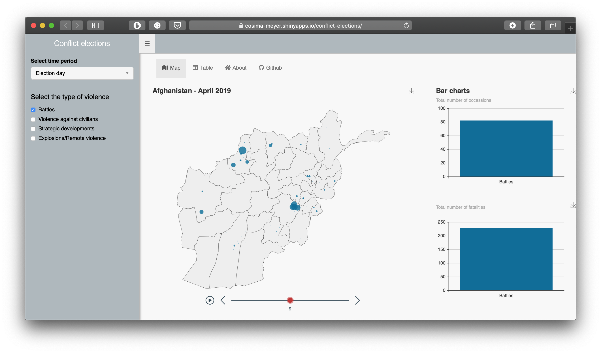
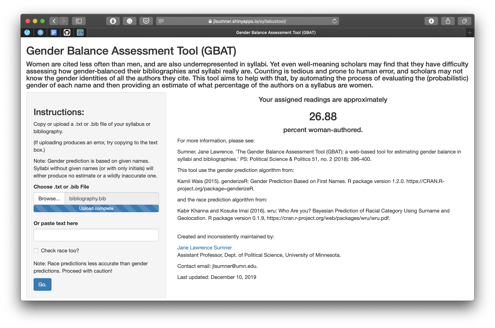
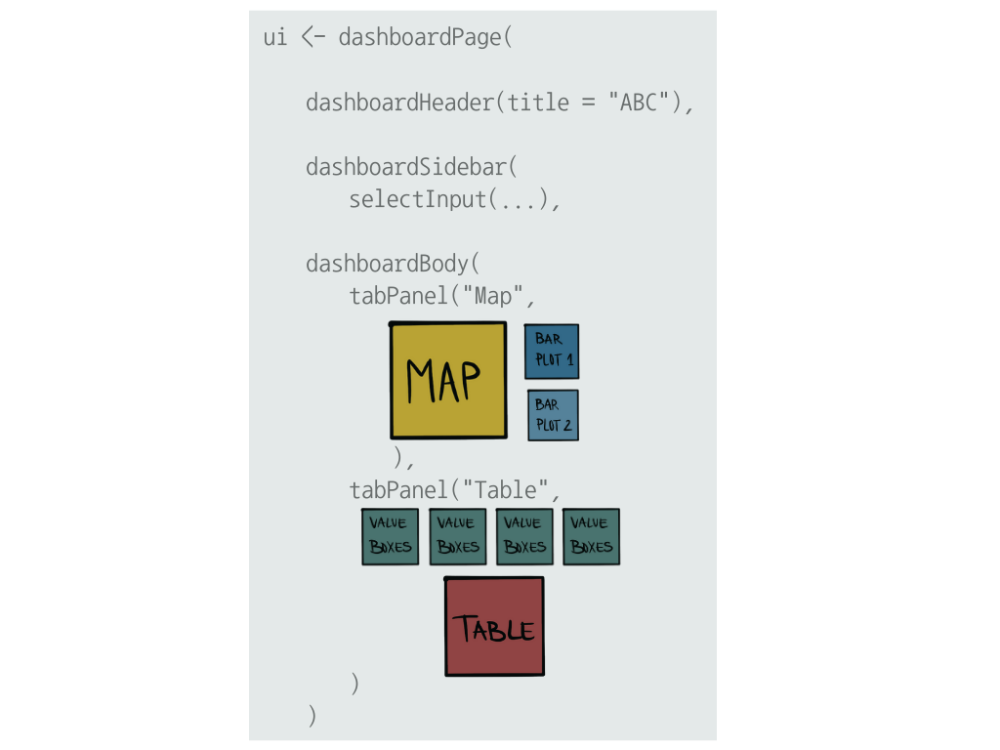
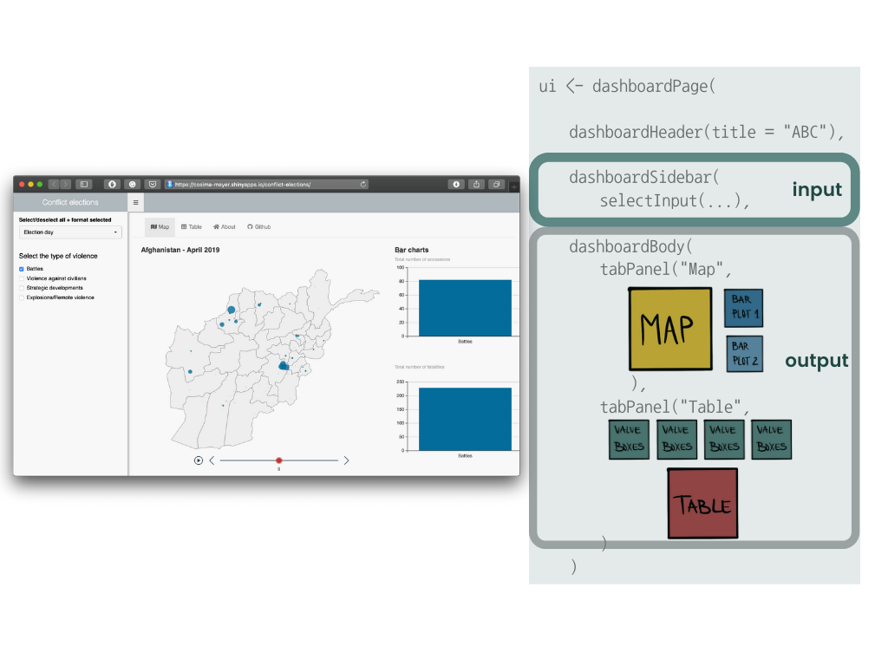
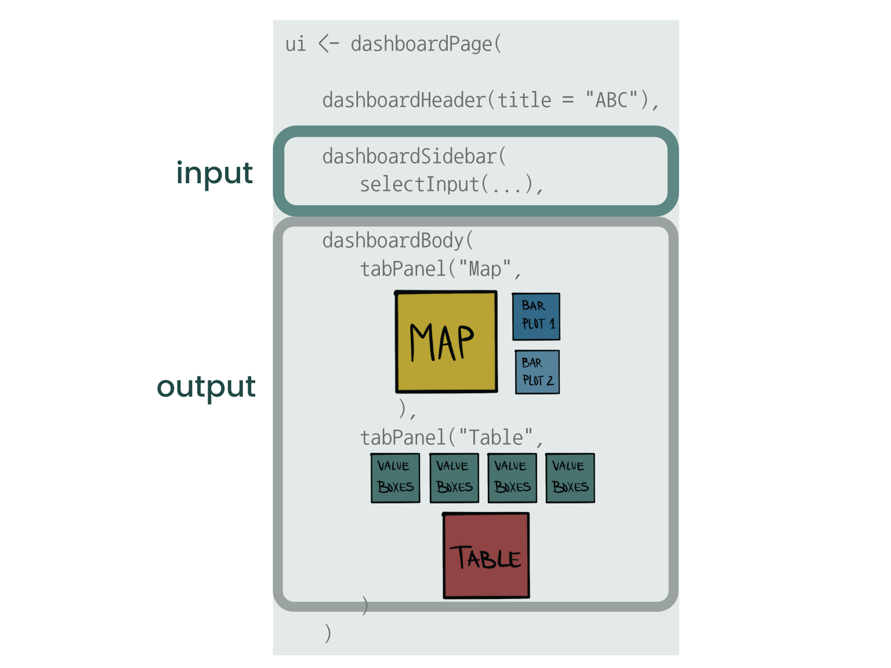
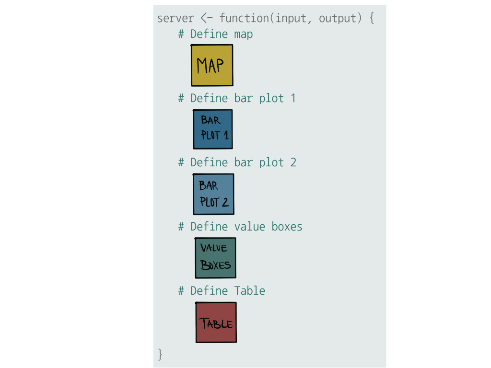
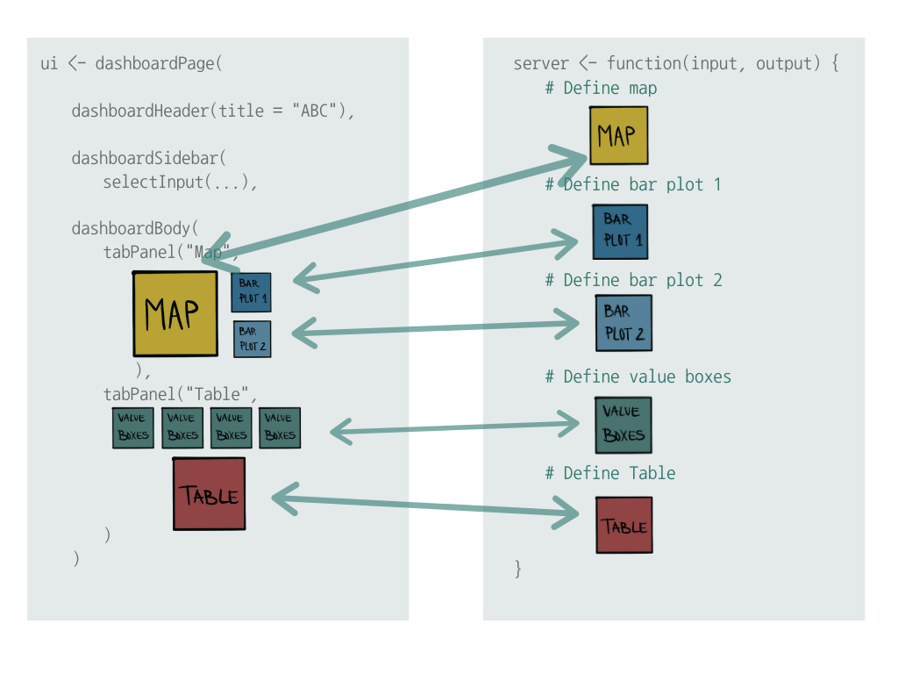

```{r load_packages, message=FALSE, warning=FALSE, include=FALSE} 
# devtools::install_github("rstudio/fontawesome")

library(fontawesome)
library(xaringanExtra)

options(htmltools.dir.version = FALSE)

library(xaringanthemer)
style_mono_accent(
  base_color = "#1c5253",
  header_font_google = google_font("Josefin Sans"),
  text_font_google   = google_font("Helvetica", "300", "300i"),
  code_font_google   = google_font("Fira Mono")
)
```

```{r xaringan-extra-styles, echo=FALSE}
xaringanExtra::use_extra_styles(
  hover_code_line = TRUE,         #<<
  mute_unhighlighted_code = TRUE  #<<
)
```

class: inverse, center, middle

# Was kann man mit ShinyApps machen?

---

### Kommunikation von wissenschaftlichen Ergebnissen

[](https://cosima-meyer.shinyapps.io/conflict-elections/)

---

### Visualisierung von Surveydatensätzen

[](https://scotland.shinyapps.io/sg-scottish-household-survey-data-explorer/)

---

### Interaktiver Appendix

[](http://134.155.108.111:3838/Populism/)

---

### Suchmaschine für (wissenschaftliche) Artikel

[](https://cosima-meyer.shinyapps.io/coro2vid-19-shinyapp/)

---

### Gender balance check

[](https://jlsumner.shinyapps.io/syllabustool/)

---

### Und so viel mehr...

[](https://shiny.rstudio.com/gallery/)

---
class: inverse, center, middle

# Wie erstelle ich eine ShinyApp in R?

---
class: inverse, center, middle
[](https://cosima-meyer.shinyapps.io/conflict-elections/)

---
class: inverse, center, middle
background-image: url(logos-all.png)
background-size: 800px

---

# Aufsetzen einer ShinyApp in R

<br>

- **UI** (user interface): Das **Aussehen** der App
<br><br><br>

- **Server**: Das **Gehirn** der App; hier wird definiert, was die App macht
<br><br><br>

- **shinyApp()**: Bringt das UI und den Server zusammen
<br><br><br>

- Programmieren in Shiny ist **reaktiv**

---
background-image: url(app8.png)
background-size: 800px

---
background-image: url(app7.png)
background-size: 800px

---
background-image: url(app6.png)
background-size: 800px


---
background-image: url("fullbody.png")
background-size: 150px
background-position: 95% 8%

### ui.R 

Bestimmt das **Aussehen** der App



---
background-image: url("fullbody.png")
background-size: 150px
background-position: 95% 8%

### ui.R 



<!-- --- -->
<!-- background-image: url("body.png") -->
<!-- background-size: 150px -->
<!-- background-position: 95% 8% -->

<!-- ### ui.R  -->

<!--  -->
---
background-image: url("head.png")
background-size: 200px
background-position: 95% 8%

### server.R 

Kreiert das **Gehirn** der App



---

### shinyApp()


**Als letzter Schritt:**
<br>

Das **UI** mit dem **Server** kombinieren
<br>  <br>  <br>  <br>  

.center[
```{r, eval=FALSE}
shinyApp(ui = ui, server = server)
```
]

---

class: inverse, middle, center

# Das Geheimnis hinter Shiny-Apps ist das sogenannte *reaktive Programmieren* ("reactive programming")

---

### Was ist "reactivity"?


---

### Was ist "reactivity"?

</br></br>
</br>
</br>
<blockquote>
Reactivity creates the illusion that <b>changes in input values automatically flow</b> to the plots, text, and tables that use the input—and cause them to update.
.right[<cite>Garrett Grolemund</cite>]
</blockquote>

---

### Was ist "reactivity"?


.center[Inspiriert von Garret Grolemunds Blogpost]

---

### Was ist "reactivity"?


.center[Inspiriert von Garret Grolemunds Blogpost]

---

### Was ist "reactivity"?


.center[Inspiriert von Garret Grolemunds Blogpost]

---

### Was ist "reactivity"?


.center[Inspiriert von Garret Grolemunds Blogpost]

---

### Was ist "reactivity"?


.center[Inspiriert von Garret Grolemunds Blogpost]
---

### Was ist "reactivity"?


.center[Inspiriert von Garret Grolemunds Blogpost]

---

### Was ist "reactivity"?


.center[Inspiriert von Garret Grolemunds Blogpost]

---

### Was ist "reactivity"?


.center[Inspiriert von Garret Grolemunds Blogpost]


---

### Reactive programming

Programmieren in Shiny folgt außerdem keiner sequentiellen Logik, sondern ist event-basiert

--

**Alles muss miteinander verbunden sein**



---
class: inverse, middle, center

# Build your own ShinyApp

---
class: inverse

<br><br><br>
# Mehr Ressourcen

.pull-left[.small[
- Shiny

  - [R Studio tutorial](https://shiny.rstudio.com/tutorial/)
  - [Hadley Wickham: Mastering Shiny](https://mastering-shiny.org)
  - [Konstantin Gavras and Nick Baumann: Shiny Apps: Development and Deployment](https://www.mzes.uni-mannheim.de/socialsciencedatalab/article/shiny-apps/) auf Methods Bites
  - [Julie Scholler: Intro to Shiny Web App](https://juliescholler.gitlab.io/files/M2/M2-CM3-Shiny.html#1)
  - [Kaleen L. Medeiros: Introduction to Shiny](https://github.com/klmedeiros/rladies-tunisia-july2020-intro-shiny)
  - [Garrett Grolemund: How to understand reactivity in R](https://shiny.rstudio.com/articles/understanding-reactivity.html)
  - [CheatSheet](https://shiny.rstudio.com/images/shiny-cheatsheet.pdf)
  
- ShinyApps hosten
  - [Hosting and deployment](https://shiny.rstudio.com/articles/shinyapps.html)
  - [Shinyapps.io - Step-by-step guide](https://shiny.rstudio.com/articles/shinyapps.html)

]]
  
.pull-right[.small[
- echarts4r
  - [echarts4r vignette](https://echarts4r.john-coene.com/index.html)
  - [Paul Simmering: Exploring echarts4r](https://rpubs.com/paul_simmering/echarts)
  
- Value boxes
  - [Joshua Kunst: valueBoxes and Sparklines](https://jkunst.com/blog/posts/2020-06-26-valuebox-and-sparklines/)

- Shiny dashboards
  - [R Studio tutorial](https://rstudio.github.io/shinydashboard/)
  - [Themes](https://github.com/nik01010/dashboardthemes)

- Optimieren von ShinyApps
  - [Make your ShinyApp faster](https://appsilon.com/r-shiny-faster-updateinput-css-javascript/)
  - [shiny.worker](https://www.r-bloggers.com/shiny-worker-speed-up-r-shiny-apps-by-offloading-heavy-calculations/)
]]

---
.footer[Abbildungen sind entweder von mir oder wurden über canva.com bezogen]
