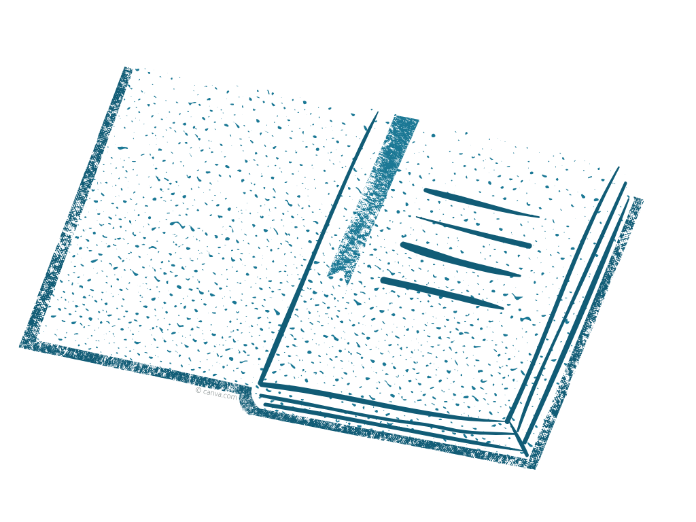
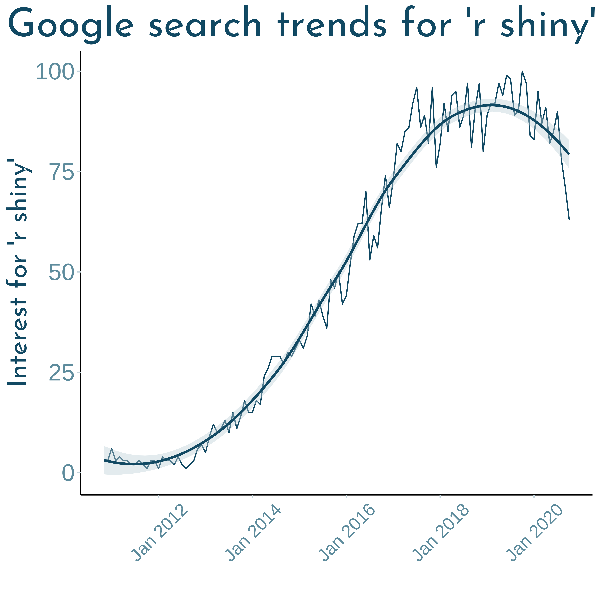
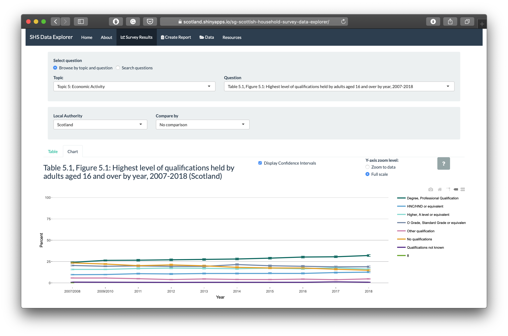
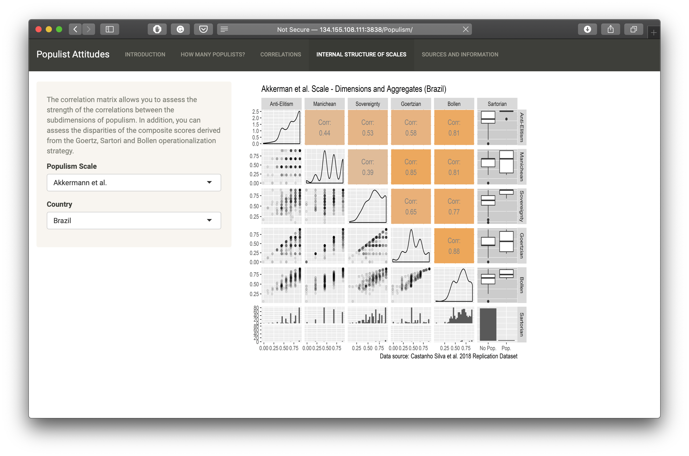
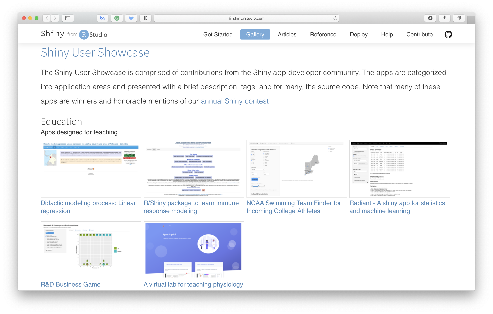
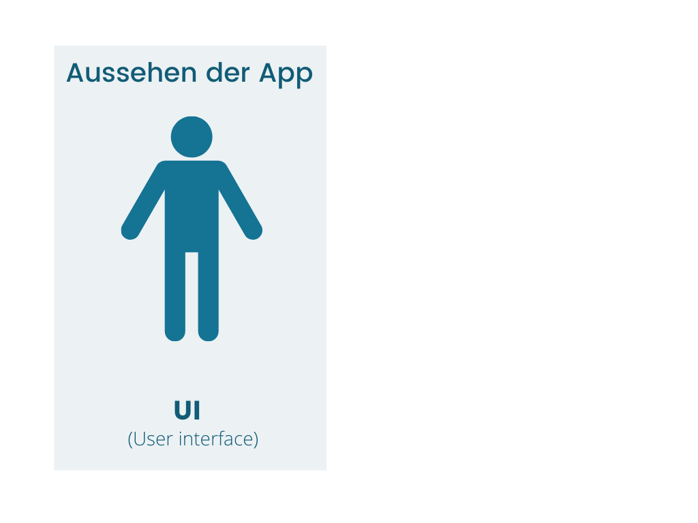
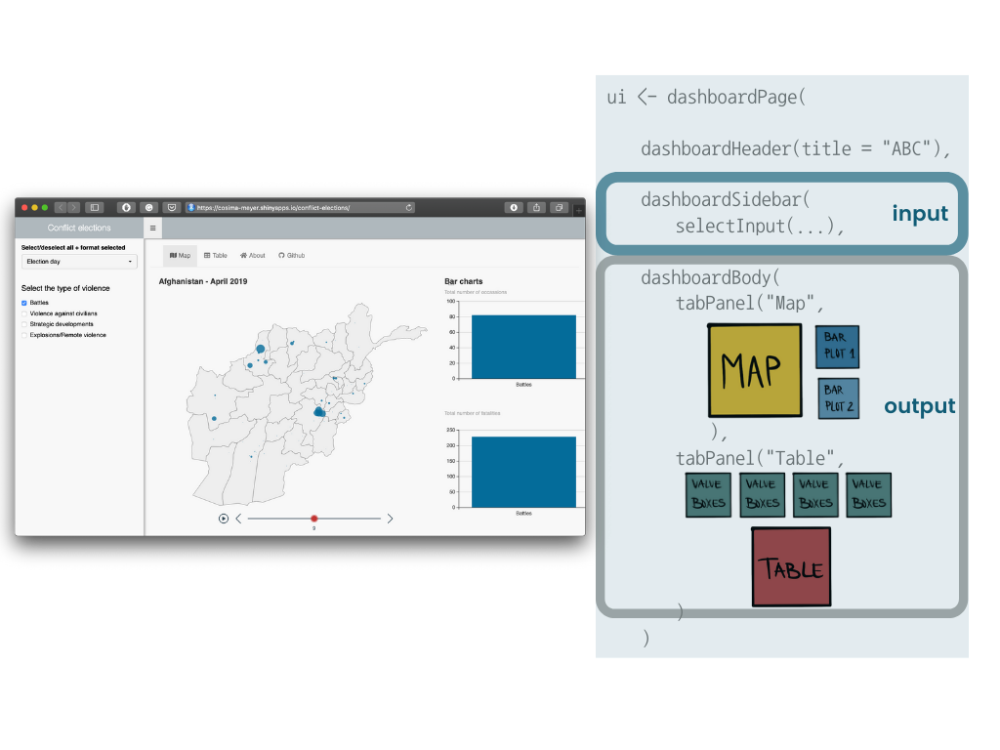
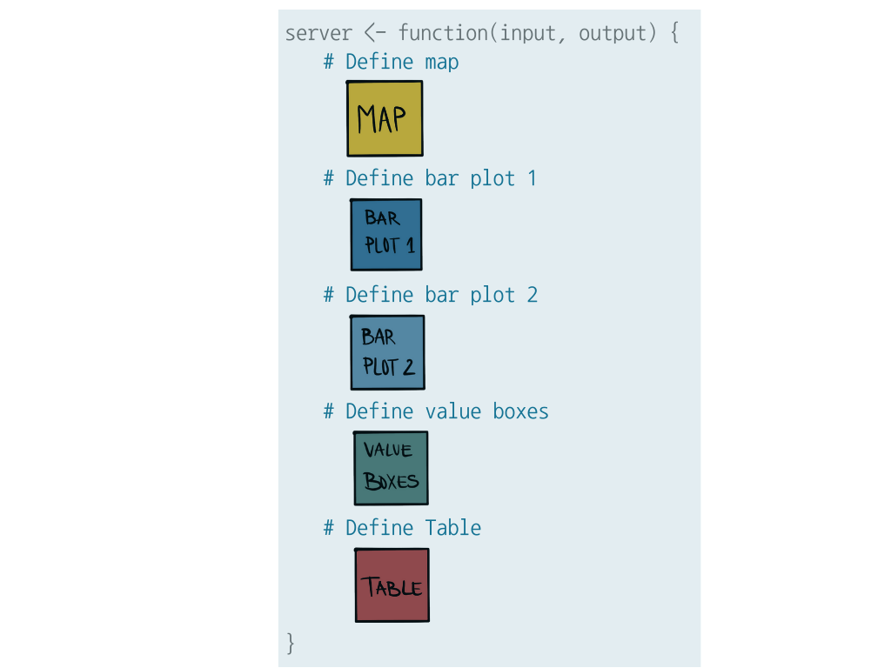
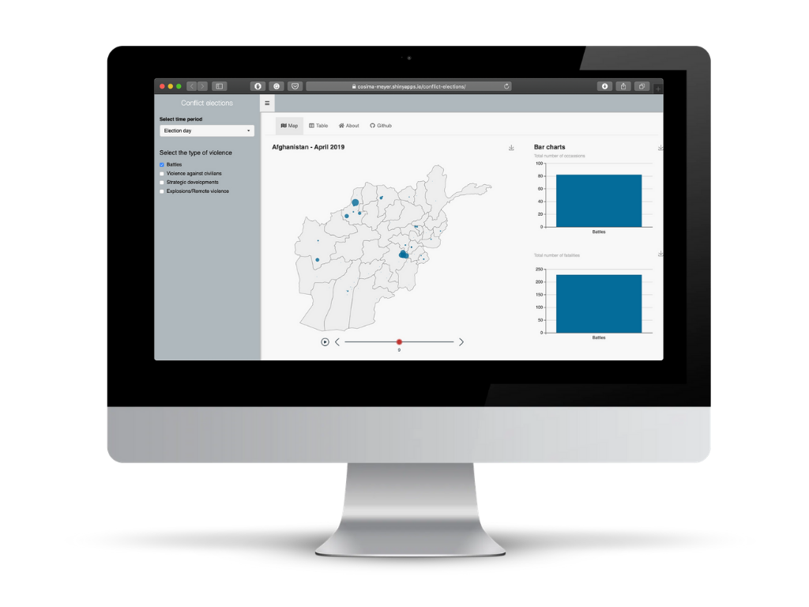

```{r load_packages, message=FALSE, warning=FALSE, include=FALSE} 
# devtools::install_github("rstudio/fontawesome")

library(fontawesome)
library(xaringanExtra)

options(htmltools.dir.version = FALSE)

library(xaringanthemer)
style_mono_accent(
  base_color = "#1c5253",
  header_font_google = google_font("Josefin Sans"),
  text_font_google   = google_font("Helvetica", "300", "300i"),
  code_font_google   = google_font("Fira Mono")
)
```

```{r xaringan-extra-styles, echo=FALSE}
xaringanExtra::use_extra_styles(
  hover_code_line = TRUE,         #<<
  mute_unhighlighted_code = TRUE  #<<
)
```

## Forscherin und Datenliebhaberin


.left-column[

<br>

 

<br>


]

.right-column[
**Doktorandin** und **wissenschaftliche Mitarbeiterin** an der Universität Mannheim

<br><br><br>
**Mitgründerin** und **Mitherausgeberin** des Data Science Blogs [**Methods Bites**](https://www.mzes.uni-mannheim.de/socialsciencedatalab/)

<br><br><br><br><br>
**Autorin** des R-Packages [**overviewR**](https://cosimameyer.github.io/overviewR/)
]

---
class: center 

## Ihr seid in guter Gesellschaft...

```{r, message=FALSE, echo=FALSE}
load("shiny.RData")
```

```{r, message=FALSE, error=FALSE, warning=FALSE, echo=FALSE,results='hide',fig.keep='all', eval=FALSE}
shiny %>% ggplot() + geom_line(aes(x = yearmon(month), y = number)) +
  labs(title = "Google search trends for 'r shiny'",
       x = "", y = "Interest for 'r shiny'") +
  theme_xaringan(text_color="#115c76", accent_color = "#115c76",accent_secondary_color = "#115c76")+
  theme(axis.text.x = element_text(angle = 45, vjust = 0.5, hjust=0.5, size=15),
        panel.grid.major = element_blank(), panel.grid.minor = element_blank(),
panel.background = element_blank(), axis.line = element_line(colour = "black")) +  #manually set limits
  geom_smooth(aes(x = yearmon(month), y = number))
ggsave(filename="shiny-plot.png", dpi=700)
```


---

## ShinyApp - Was ist das eigentlich?

.pull-left[
```{r, message=FALSE, echo=FALSE}
load("shiny.RData")
```

```{r, message=FALSE, error=FALSE, warning=FALSE, echo=FALSE,results='hide',fig.keep='all', eval=FALSE}
shiny %>% ggplot() + geom_line(aes(x = yearmon(month), y = number)) +
  labs(title = "Google search trends for 'r shiny'",
       x = "", y = "Interest for 'r shiny'") +
  theme_xaringan()+
  theme(axis.text.x = element_text(angle = 45, vjust = 0.5, hjust=0.5, size=15),
        panel.grid.major = element_blank(), panel.grid.minor = element_blank(),
panel.background = element_blank(), axis.line = element_line(colour = "black")) +  #manually set limits
  geom_smooth(aes(x = yearmon(month), y = number))
```

]
.pull-right[

- Web-basierte Anwendung, die
  - **(data) storytelling** erlaubt,

  - Ergebnisse **interaktiv kommuniziert**,

  - ein **professionelles Design** hat und **kosteneffizient** ist, 
  
  - **und das beste:** Man kann schon mit wenig R-Kenntnissen ganz leicht eine ShinyApp bauen!
]

---
class: inverse, center, middle

# Was kann man mit ShinyApps machen?

---

### Kommunikation von wissenschaftlichen Ergebnissen

[](https://cosima-meyer.shinyapps.io/conflict-elections/)

---

### Visualisierung von Surveydatensätzen

[](https://scotland.shinyapps.io/sg-scottish-household-survey-data-explorer/)

---

### Interaktiver Appendix

[](http://134.155.108.111:3838/Populism/)

---

### Suchmaschine für (wissenschaftliche) Artikel

[](https://cosima-meyer.shinyapps.io/coro2vid-19-shinyapp/)

---

### Und so viel mehr...

[](https://shiny.rstudio.com/gallery/)

---
class: inverse, center, middle

# Wie erstelle ich eine ShinyApp in R?

---

# Aufsetzen einer ShinyApp

<br>



---

# Aufsetzen einer ShinyApp

<br>


---

# Aufsetzen einer ShinyApp

<br>


---
class: inverse, center, middle
[](https://cosima-meyer.shinyapps.io/conflict-elections/)

---
background-image: url("body.png")
background-size: 150px
background-position: 95% 8%

### ui.R 

Bestimmt das **Aussehen** der App



<!-- --- -->
<!-- background-image: url("body.png") -->
<!-- background-size: 150px -->
<!-- background-position: 95% 8% -->

<!-- ### ui.R  -->

<!--  -->
---
background-image: url("head.png")
background-size: 200px
background-position: 95% 8%

### server.R 

Kreiert das **Gehirn** der App



---

### shinyApp()


**Als letzter Schritt:**
<br>

Das **UI** mit dem **Server** kombinieren
<br>  <br>  <br>  <br>  

.center[
```{r, eval=FALSE}
shinyApp(ui = ui, server = server)
```
]

---

[](https://cosima-meyer.shinyapps.io/conflict-elections/)

---
class: inverse
background-image: url("computer.png")
background-size: 200px
background-position: 95% 8%

<br><br><br>
# Mehr Ressourcen

.pull-left[.small[
- Shiny

  - [R Studio tutorial](https://shiny.rstudio.com/tutorial/)
  - [Hadley Wickham: Mastering Shiny](https://mastering-shiny.org)
  - [Konstantin Gavras and Nick Baumann: Shiny Apps: Development and Deployment](https://www.mzes.uni-mannheim.de/socialsciencedatalab/article/shiny-apps/) auf Methods Bites
  - [Julie Scholler: Intro to Shiny Web App](https://juliescholler.gitlab.io/files/M2/M2-CM3-Shiny.html#1)
  - [Kaleen L. Medeiros: Introduction to Shiny](https://github.com/klmedeiros/rladies-tunisia-july2020-intro-shiny)
  - [Garrett Grolemund: How to understand reactivity in R](https://shiny.rstudio.com/articles/understanding-reactivity.html)
  - [CheatSheet](https://shiny.rstudio.com/images/shiny-cheatsheet.pdf)
  
- ShinyApps hosten
  - [Hosting and deployment](https://shiny.rstudio.com/articles/shinyapps.html)
  - [Shinyapps.io - Step-by-step guide](https://shiny.rstudio.com/articles/shinyapps.html)

]]
  
.pull-right[.small[
- echarts4r
  - [echarts4r vignette](https://echarts4r.john-coene.com/index.html)
  - [Paul Simmering: Exploring echarts4r](https://rpubs.com/paul_simmering/echarts)
  
- Value boxes
  - [Joshua Kunst: valueBoxes and Sparklines](https://jkunst.com/blog/posts/2020-06-26-valuebox-and-sparklines/)

- Shiny dashboards
  - [R Studio tutorial](https://rstudio.github.io/shinydashboard/)
  - [Themes](https://github.com/nik01010/dashboardthemes)

- Optimieren von ShinyApps
  - [Make your ShinyApp faster](https://appsilon.com/r-shiny-faster-updateinput-css-javascript/)
  - [shiny.worker](https://www.r-bloggers.com/shiny-worker-speed-up-r-shiny-apps-by-offloading-heavy-calculations/)
]]

---
class: inverse, middle, center


`r fontawesome::fa(name = "twitter", fill = "white")` [@cosima_meyer](https://twitter.com/cosima_meyer)

`r fontawesome::fa(name = "linkedin", fill = "white")` [cosimameyer](https://www.linkedin.com/in/cosimameyer/)

`r fontawesome::fa(name = "globe", fill = "white")` [cosimameyer.com](http://cosimameyer.com) 

`r fontawesome::fa(name = "github", fill = "white")` Code und Slides </br></br>
[bit.ly/shinyApp-material](http://bit.ly/shinyApp-material)

---
.footer[Abbildungen sind entweder von mir oder wurden über canva.com bezogen]
